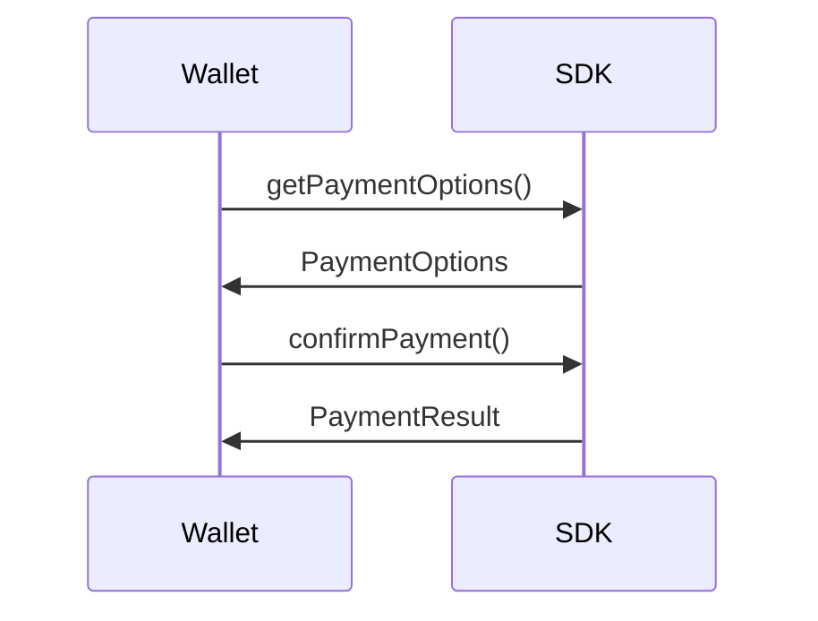
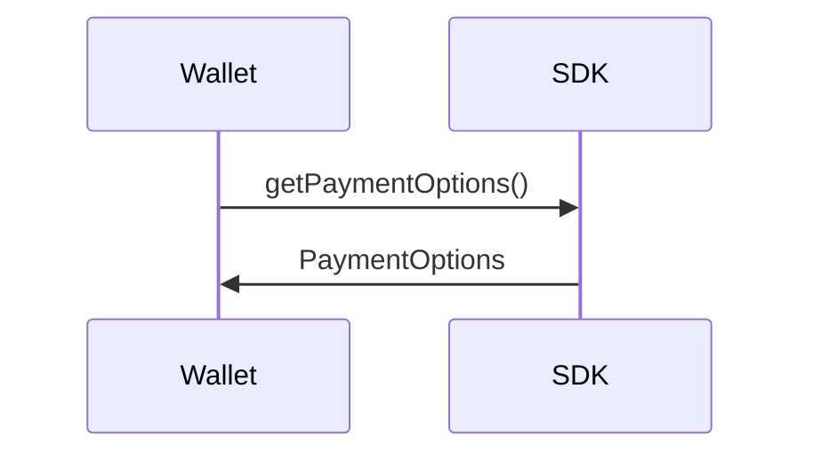

# Mintlify Components & Page Templates

## Callouts

| Type | Use Case |
|------|----------|
| `<Note>` | General supplementary information |
| `<Warning>` | Breaking changes, deprecations |
| `<Info>` | Important context or clarification |
| `<Tip>` | Best practices, recommendations |
| `<Check>` | Success states, completed steps |
| `<Danger>` | Critical warnings, potential data loss |

Custom callout:

```mdx
<Callout icon="key" color="#FFC107" iconType="regular">Custom callout</Callout>
```

## Steps

Use `<Steps>` for sequential actions. Recommended for high-level/conceptual pages.

```mdx
<Steps>
  <Step title="First Step">
    Content for step 1.
  </Step>
  <Step title="Second Step">
    Content for step 2.
  </Step>
</Steps>
```

Step properties: `title` (required), `icon` (optional), `stepNumber` (optional override).

## Cards and Columns

Use `<Columns>` with `<Card>` for CTAs. Prefer `cols={2}`.

```mdx
<Columns cols={2}>
  <Card title="Get started">
    Set up your project with the quickstart guide.
  </Card>
  <Card title="API reference">
    Explore endpoints, parameters, and examples.
  </Card>
</Columns>
```

## Code Groups

Use `<CodeGroup>` for multi-language/platform examples. Each code block needs a title.

````mdx
<CodeGroup>
```javascript helloWorld.js
console.log("Hello World");
```

```python hello_world.py
print('Hello World!')
```
</CodeGroup>
````

Add `dropdown` prop for dropdown menu instead of tabs: `<CodeGroup dropdown>`.

## Accordions

Use `<AccordionGroup>` for FAQs.

```mdx
<AccordionGroup>
  <Accordion title="What networks does WalletConnect Pay support?">
    WalletConnect Pay currently supports Ethereum, Base, Optimism, Polygon, and Arbitrum.
  </Accordion>
  <Accordion title="How do I obtain an API key?">
    Fill out the contact form and the WalletConnect team will provide your API credentials.
  </Accordion>
</AccordionGroup>
```

Properties: `title` (required), `description`, `defaultOpen`, `icon`.

## Mermaid Diagrams

Use for payment flows, architecture, SDK workflows, multi-step API interactions.



## Page Templates

### Overview/Conceptual Page

```mdx
---
title: "WalletConnect Pay"
description: "A universal protocol for blockchain-based payment requests."
sidebarTitle: "Introduction"
---

[Brief introduction - 1-2 paragraphs]

## Who is WalletConnect Pay for?

[Audience segments]

## How does WalletConnect Pay work?

[High-level flow - consider <Steps> or Mermaid diagram]

## Get Started

<Columns cols={2}>
  <Card title="For PSPs" icon="building" href="/psp-guide">
    Integrate WalletConnect Pay into your payment stack.
  </Card>
  <Card title="For Wallets" icon="wallet" href="/wallet-guide">
    Enable payments for your wallet users.
  </Card>
</Columns>
```

### Technical/SDK Page

````mdx
---
title: "WalletConnect Pay SDK - Kotlin"
description: "Integrate WalletConnect Pay into your Android wallet application."
sidebarTitle: "Kotlin"
---

[One-line description]

<Warning>
Important notice about prerequisites or upcoming changes.
</Warning>

## Requirements

[Platform versions, dependencies]

## Installation

[Package manager commands]

## Configuration

[Init code + explanation]

### Configuration Parameters

| Parameter | Type | Required | Description |
|-----------|------|----------|-------------|
| `apiKey` | `String` | Yes | Your WalletConnect Pay API key |

## Payment Flow



<Steps>
  <Step title="Get Payment Options">
    Code and explanation.
  </Step>
  <Step title="Confirm Payment">
    Code and explanation.
  </Step>
</Steps>

## Complete Example

[Full working code]

## Error Handling

[Error types table]

## Troubleshooting

[Common issues]

## Frequently Asked Questions

<AccordionGroup>
  <Accordion title="Common question?">
    Answer.
  </Accordion>
</AccordionGroup>
````
