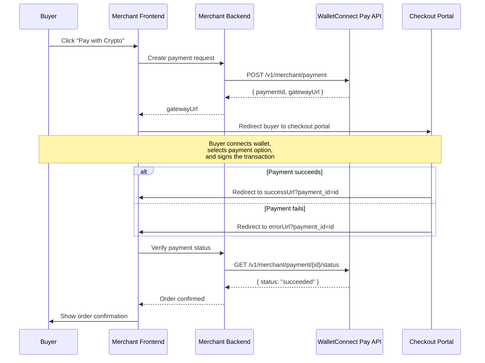

Integrate WalletConnect Pay into your online checkout so buyers can pay with crypto from any wallet, using the assets they already hold.

## Prerequisites

Before you begin, make sure you have:

- **Completed merchant onboarding** — sign up and complete KYB verification on the [Merchant Dashboard](/payments/merchant/onboarding)
- **Partner API Key** — available in your Merchant Dashboard after onboarding
- **Merchant ID** — your merchant identifier from the Merchant Dashboard
- **A backend server** — all API calls must be made server-side to keep your API key secure

## How It Works

The checkout integration follows a redirect-based flow. Your backend creates a payment, redirects the buyer to the WalletConnect Pay checkout portal, and verifies the result after the buyer returns.



## Integration Steps

<Steps>
  <Step title="Create a Payment" icon="file-invoice-dollar">
    From your backend, call the Merchant API to create a payment with the order amount and redirect URLs.

    ```typescript
    // Server-side only
    const response = await fetch(
      "https://api.pay.walletconnect.org/v1/merchant/payment",
      {
        method: "POST",
        headers: {
          "Content-Type": "application/json",
          "Api-Key": process.env.WCP_API_KEY,
          "Merchant-Id": process.env.WCP_MERCHANT_ID,
        },
        body: JSON.stringify({
          amount: {
            unit: "iso4217/USD",
            value: String(order.totalCents), // e.g., "5000" for $50.00
          },
          referenceId: order.id,
          checkout: {
            successUrl: `${process.env.BASE_URL}/order/${order.id}/success`,
            errorUrl: `${process.env.BASE_URL}/order/${order.id}/failed`,
          },
        }),
      }
    );

    const { paymentId, gatewayUrl } = await response.json();
    ```

    Store the `paymentId` in your database alongside the order so you can verify the payment later.

    <Info>
    The `amount.value` is in **minor currency units** — for USD, `"5000"` equals $50.00. See the [API Reference](/payments/ecommerce/api-reference) for details.
    </Info>
  </Step>

  <Step title="Redirect the Buyer" icon="arrow-up-right-from-square">
    Redirect the buyer to the `gatewayUrl` returned by the API. This takes them to the WalletConnect Pay checkout portal where they can connect their wallet, choose a payment option, and complete the transaction.

    ```typescript
    // Client-side: redirect to checkout portal
    window.location.href = gatewayUrl;
    ```

    The checkout portal handles the entire buyer-side payment flow — no additional integration is needed on your end for this step.
  </Step>

  <Step title="Handle the Return" icon="rotate-left">
    After the payment completes (or fails), the checkout portal redirects the buyer back to your site:

    - **Success**: `{successUrl}?payment_id={paymentId}`
    - **Failure**: `{errorUrl}?payment_id={paymentId}`

    The redirect happens automatically after a 3-second countdown on the checkout portal.

    ```typescript
    // Extract the payment ID from the redirect URL
    const url = new URL(window.location.href);
    const paymentId = url.searchParams.get("payment_id");

    // Verify the payment status from your backend (next step)
    const status = await verifyPayment(paymentId);
    ```

    <Warning>
    **Never trust the redirect URL alone.** The redirect can be spoofed by a buyer navigating directly to your success URL. Always verify the payment status server-side before fulfilling an order.
    </Warning>
  </Step>

  <Step title="Verify Payment Status" icon="shield-check">
    From your backend, call the status endpoint to get the authoritative payment result.

    ```typescript
    // Server-side: verify payment status
    const response = await fetch(
      `https://api.pay.walletconnect.org/v1/merchant/payment/${paymentId}/status`,
      {
        headers: {
          "Api-Key": process.env.WCP_API_KEY,
          "Merchant-Id": process.env.WCP_MERCHANT_ID,
        },
      }
    );

    const { status, isFinal } = await response.json();

    if (status === "succeeded") {
      await fulfillOrder(orderId);
    } else if (status === "processing") {
      // Transaction submitted but not yet confirmed — check again shortly
    } else {
      // "failed" or "expired" — inform the buyer
    }
    ```

    If `isFinal` is `false` (status is `processing`), poll the endpoint at a reasonable interval until the payment reaches a terminal state.

    | Status | Terminal | Action |
    |--------|----------|--------|
    | `succeeded` | Yes | Fulfill the order |
    | `failed` | Yes | Show error, offer retry |
    | `expired` | Yes | Show expiry message, offer new payment |
    | `processing` | No | Poll again after a short delay |

    See the full [API Reference](/payments/ecommerce/api-reference) for endpoint details and error codes.
  </Step>
</Steps>

## Checkout URL Requirements

<Note>
Both `successUrl` and `errorUrl` must be valid **HTTPS** URLs. If either is missing or fails validation, the redirect feature is disabled for that payment — the checkout portal will show a generic success or error message instead.
</Note>

- The checkout portal appends `?payment_id={id}` to your callback URLs automatically
- There is no `cancelUrl` — if the buyer abandons the flow, they simply close the tab
- Include your order reference in the URL path (e.g., `/order/{orderId}/success`) so you can correlate the redirect with the right order

## Merchant Branding

The checkout portal displays your merchant name and icon to the buyer during the payment flow. These are configured in the [Merchant Dashboard](/payments/merchant/onboarding):

- **`merchant.name`** — displayed in the payment summary
- **`merchant.iconUrl`** — displayed alongside your name

<Info>
For best results, use a square icon with a minimum size of 72x72px in PNG, SVG, or WebP format.
</Info>

## Testing

Use the staging environment to test your integration before going live:

| Environment | API Base URL |
|-------------|-------------|
| Production | `https://api.pay.walletconnect.org` |
| Staging | `https://staging.api.pay.walletconnect.org` |

Contact the WalletConnect team to obtain staging credentials.

## Example Implementation

A complete working reference implementation is available in the WalletConnect buyer-experience repository:

<CardGroup cols={1}>
  <Card title="Ecommerce Example (Next.js)" icon="github" href="https://github.com/WalletConnect/buyer-experience/tree/main/examples/ecommerce-poc">
    Full-stack example showing payment creation, checkout redirect, and order verification.
  </Card>
</CardGroup>

The example includes:
- **API client** — payment creation with checkout URLs
- **Checkout route** — creates a payment and redirects the buyer
- **Order confirmation page** — receives the redirect and displays order status
