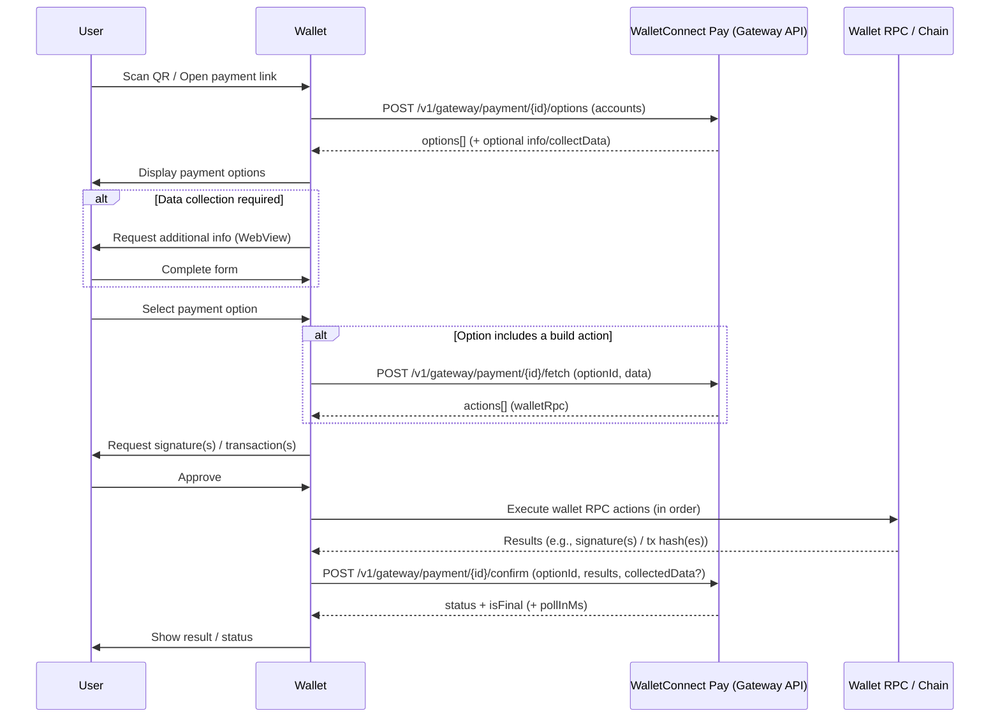

If you're integrating WalletConnect Pay into a wallet **without using the Wallet Pay SDK**, you can use an API-first approach via the **Gateway API**.

This flow is centered around **three Gateway calls**:

- **Get payment options**: list options the user can complete with their wallet/accounts
- **Fetch an action**: resolve "build" actions into wallet RPC actions when needed
- **Confirm a payment**: submit the selected option and the executed action results

## Prerequisites

- **API key**: request access from WalletConnect
  - You can do this by filling out [**this form**](https://share.hsforms.com/19Dpp4ayYR9uriB3xNAh0JAnxw6s) and getting in touch with our team.
- **Required headers** on each request:
  - `Api-Key` — your API key


## Payment flow

The payment flow mirrors the SDK flow, but you call the Gateway API directly:

**Get Options → (Collect Data) → (Fetch Actions) → Execute Wallet RPC → Confirm Payment**



## Understanding `actions`

Payment options can include an `actions[]` array. Each action tells your wallet what needs to happen next.

- **`walletRpc` actions**
  - The Gateway gives you a wallet RPC payload (`chain_id`, `method`, `params`)
  - Your wallet should execute it (sign / send), then record the output to submit in `results[]`

- **`build` actions**
  - The action is not directly executable by the wallet
  - Call **Fetch an action** to convert the `build` payload into one or more **`walletRpc`** actions

<Warning>
Maintain action ordering. The `results[]` you submit in **Confirm a payment** must correspond to the actions you executed, in order.
</Warning>

## High-level steps

### 1) Get payment options

Call **Get payment options** for the given `paymentId`, passing a list of accounts (CAIP-10 / chain namespace format as provided by your wallet).

- Use this response to render:
  - payment details (optionally, if `includePaymentInfo=true`)
  - available `options[]` the user can pick from
  - required `actions[]` for the chosen option

### 2) Fetch an action (only if required)

If an option contains an action of type **`build`**, call **Fetch an action** with that `optionId` and the `data` payload to resolve it into one or more executable actions (typically `walletRpc`).

### 3) Confirm a payment

After your wallet executes the required `walletRpc` actions (sign/submit), call **Confirm a payment** with:

- the selected `optionId`
- `results[]`: the output from each executed action (in the same order you performed them)
- optional `collectedData` if the options response requested additional user info

<Info>
If you used the **WebView-based data collection** flow (i.e., displayed `collectData.url` in a WebView), there is no need to send `collectedData` in the confirm request — the WebView submits user data directly to the backend.
</Info>

<Note>
If `isFinal` is `false`, the response may include `pollInMs`. Use it to decide when to check again (see the API Reference for status/polling behavior).
</Note>

<Info>
The WalletConnect Pay SDKs support **WebView-based data collection**. When `collectData.url` is present in the payment options response, wallets can display this URL in a WebView instead of building native forms. The WebView handles form rendering, validation, and T&C acceptance, and submits data directly to the backend. See the [platform-specific SDK documentation](/payments/wallets/overview) for implementation details.
</Info>

## Integration guidelines

These guidelines reflect the patterns used internally by the WalletConnect Pay SDK. Following them ensures a smooth, reliable UX.

### Payment link detection

Payment links can arrive in several formats. Your wallet should detect and extract the `paymentId` from:

| Format | Example |
|--------|---------|
| WC Pay URL (path) | `https://pay.walletconnect.com/pay_123` |
| WC Pay URL (query) | `https://pay.walletconnect.com/?pid=pay_123` |
| `wc:` URI with `pay=` param | `wc:abc@2?pay=https%3A%2F%2Fpay.walletconnect.com%2F%3Fpid%3Dpay_123` |
| Bare payment ID | `pay_123` |

<Warning>
Only trust `pay.walletconnect.com` and `*.pay.walletconnect.com` as valid WC Pay hosts. Always validate the domain before extracting a payment ID.
</Warning>

<Note>
Check for payment links **before** handling generic URLs or WalletConnect pairing URIs. Payment links are HTTPS URLs that would otherwise open in a browser.
</Note>

### Providing accounts

Pass all of the user's accounts in **CAIP-10 format** (`eip155:{chainId}:{address}`) when calling **Get payment options**. Include accounts for every supported chain to maximize the number of payment options returned.

### Resolving `build` actions

When an option's `actions[]` contains a `build` action, it cannot be executed directly. Call **Fetch an action** (`POST /v1/gateway/payment/{id}/fetch`) with the `optionId` and the build action's `data` string. The response will contain one or more `walletRpc` actions that your wallet can execute.

<Note>
A single `build` action may resolve into multiple `walletRpc` actions. Always iterate over the full response.
</Note>

### Executing wallet RPC actions

Each `walletRpc` action contains:
- `chain_id` — the chain to execute on (CAIP-2 format, e.g., `eip155:8453`)
- `method` — the RPC method (e.g., `eth_signTypedData_v4`, `personal_sign`)
- `params` — JSON-encoded parameters

Execute each action in order using your wallet's signing implementation, and collect the result (e.g., signature hex string) for each.

### Submitting results

When calling **Confirm a payment**, wrap each signature as a `walletRpc` result:

```json
{
  "optionId": "opt_123",
  "results": [
    { "type": "walletRpc", "data": ["0x<signature_1>"] },
    { "type": "walletRpc", "data": ["0x<signature_2>"] }
  ]
}
```

<Warning>
The `results[]` array **must** match the `actions[]` array in both length and order. Misalignment causes payment failures.
</Warning>

### Polling for final status

After **Confirm a payment** returns, check the `isFinal` field:

- **`isFinal: true`** — the payment has reached a terminal state (`succeeded`, `failed`, or `expired`). No further action needed.
- **`isFinal: false`** — the payment is still processing. Use the `pollInMs` value from the response as the delay before your next confirm call.

Use the `maxPollMs` query parameter on the confirm request to enable **server-side long-polling** — the server will hold the connection and return as soon as the status changes or the timeout expires, reducing the number of round-trips.

```
POST /v1/gateway/payment/{id}/confirm?maxPollMs=30000
```

### Retry strategy

Implement retries with **exponential backoff and jitter** for resilience:

- **Retry only on** server errors (5xx) and network failures (connection refused, timeout)
- **Do not retry** client errors (4xx) — these indicate invalid input and won't succeed on retry
- **Recommended**: 3 retries with 100ms initial backoff, doubling each attempt, plus random jitter

### Data collection

If the **Get payment options** response includes a `collectData` object with a `url` field, display it in a WebView before confirming. The WebView handles form rendering, validation, and T&C acceptance. When the WebView signals completion (`IC_COMPLETE` via JS bridge), proceed to confirm — no need to include `collectedData` in the request.

If you choose not to use the WebView and instead build your own form, use the `collectData.schema` JSON schema to determine the required fields, collect the values, and pass them as `collectedData` in the confirm request.

### Expiration handling

Payments have an expiration timestamp (`expiresAt` in the payment info). Display a countdown or warning to the user when time is running low, and prevent submission after expiry.

If a payment or route expires mid-flow, the API returns a `410` (payment expired) or `409` (route expired) error. Handle these gracefully by informing the user and offering to start over if a new payment link is available.

## API Reference

For request/response schemas and examples for each Gateway endpoint, see the **[API Reference](/api-reference)**.
