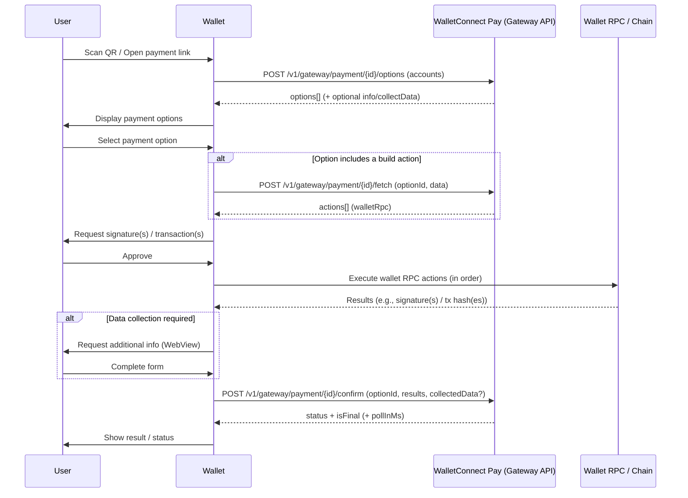

If you're integrating WalletConnect Pay into a wallet **without using the Wallet Pay SDK**, you can use an API-first approach via the **Gateway API**.

This flow is centered around **three Gateway calls**:

- **Get payment options**: list options the user can complete with their wallet/accounts
- **Fetch an action**: resolve "build" actions into wallet RPC actions when needed
- **Confirm a payment**: submit the selected option and the executed action results

## Prerequisites

- **API key**: request access from WalletConnect
  - You can do this by filling out [**this form**](https://share.hsforms.com/19Dpp4ayYR9uriB3xNAh0JAnxw6s) and getting in touch with our team.
- **Required headers** on each request:
  - `Api-Key` — your API key

<Warning>
Do **not** set `Sdk-Name`, `Sdk-Version`, or `Sdk-Platform` headers. These are reserved for WalletConnect's own SDKs and should not be used for custom integrations.
</Warning>

## Payment flow

The payment flow mirrors the SDK flow, but you call the Gateway API directly:

**Get Options → (Fetch Actions) → Execute Wallet RPC → (Collect Data) → Confirm Payment**

## Understanding `actions`

Payment options can include an `actions[]` array. Each action tells your wallet what needs to happen next.

- **`walletRpc` actions**
  - The Gateway gives you a wallet RPC payload (`chain_id`, `method`, `params`)
  - Your wallet should execute it (sign / send), then record the output to submit in `results[]`

- **`build` actions**
  - The action is not directly executable by the wallet
  - Call **Fetch an action** to convert the `build` payload into one or more **`walletRpc`** actions

<Warning>
Maintain action ordering. The `results[]` you submit in **Confirm a payment** must correspond to the actions you executed, in order.
</Warning>

## High-level steps

### 1) Get payment options

Call **Get payment options** for the given `paymentId`, passing a list of accounts (CAIP-10 / chain namespace format as provided by your wallet).

- Use this response to render:
  - payment details (optionally, if `includePaymentInfo=true`)
  - available `options[]` the user can pick from
  - required `actions[]` for the chosen option

### 2) Fetch an action (only if required)

If an option contains an action of type **`build`**, call **Fetch an action** with that `optionId` and the `data` payload to resolve it into one or more executable actions (typically `walletRpc`).

### 3) Confirm a payment

After your wallet executes the required `walletRpc` actions (sign/submit), call **Confirm a payment** with:

- the selected `optionId`
- `results[]`: the output from each executed action (in the same order you performed them)
- optional `collectedData` if the options response requested additional user info

<Note>
If `isFinal` is `false`, the response may include `pollInMs`. Use it to decide when to check again (see the API Reference for status/polling behavior).
</Note>

<Info>
The WalletConnect Pay SDKs support **WebView-based data collection**. When `collectData.url` is present in the payment options response, wallets can display this URL in a WebView instead of building native forms. The WebView handles form rendering, validation, and T&C acceptance, and submits data directly to the backend. See the [platform-specific SDK documentation](/payments/wallets/overview) for implementation details.
</Info>

## API Reference

For request/response schemas and examples for each Gateway endpoint, see the **[API Reference](/api-reference)**.
