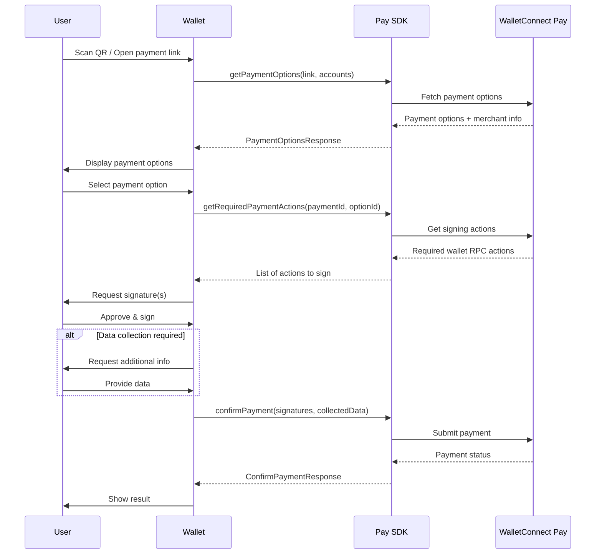

The WalletConnect Pay SDK is a Kotlin library that enables payment functionality for Android wallet applications. This SDK provides a seamless payment solution through a native provider architecture powered by Yttrium (Rust FFI).

## Requirements

- **Min SDK**: 23 (Android 6.0)
- **Target SDK**: 36
- **JVM Target**: 11

## Installation

Add the WalletConnect Pay SDK to your project's `build.gradle.kts` file:

```kotlin
dependencies {
    implementation("com.walletconnect:pay:1.0.0")
}
```

## Configuration

Initialize the SDK in your `Application` class or before any payment operations:

```kotlin
import com.walletconnect.pay.Pay
import com.walletconnect.pay.WalletConnectPay

WalletConnectPay.initialize(
    Pay.SdkConfig(
        apiKey = "your-api-key",
        projectId = "your-project-id",
        packageName = "com.your.app"
    )
)
```

### Configuration Parameters

| Parameter | Type | Required | Description |
|-----------|------|----------|-------------|
| `apiKey` | `String` | Yes | Your WalletConnect Pay API key |
| `projectId` | `String` | Yes | Your WalletConnect Cloud project ID |
| `packageName` | `String` | Yes | Your application's package name |

<Info>
Don't have a project ID? Create one at [WalletConnect Cloud](https://cloud.walletconnect.com) by signing up and creating a new project.
</Info>

<Warning>
The SDK will throw `IllegalStateException` if already initialized. Call `initialize()` only once.
</Warning>

## Supported Networks

WalletConnect Pay supports the following EVM-compatible networks:

| Network | Chain ID | CAIP-2 Identifier |
|---------|----------|-------------------|
| Ethereum Mainnet | 1 | `eip155:1` |
| Polygon | 137 | `eip155:137` |
| Base | 8453 | `eip155:8453` |
| Arbitrum One | 42161 | `eip155:42161` |
| Optimism | 10 | `eip155:10` |

<Note>
When providing accounts, use the CAIP-10 format: `eip155:{chainId}:{address}`. Include accounts for all networks you want to support to maximize payment options for your users.
</Note>

## Payment Flow

The payment flow consists of five main steps:

**Get Options → Get Actions → Sign Actions → Collect Data → Confirm Payment**



<Steps>

<Step title="Get Payment Options" titleSize="h3">

When a user scans a payment QR code or opens a payment link, fetch available payment options:

```kotlin
val result = WalletConnectPay.getPaymentOptions(
    paymentLink = "https://pay.walletconnect.com/pay_123",
    accounts = listOf(
        "eip155:1:$walletAddress",      // Ethereum Mainnet
        "eip155:137:$walletAddress",    // Polygon
        "eip155:8453:$walletAddress",   // Base
        "eip155:42161:$walletAddress"   // Arbitrum
    )
)

result.onSuccess { response ->
    val paymentId = response.paymentId
    val options = response.options
    val paymentInfo = response.info
    val collectDataAction = response.collectDataAction
    
    // Display merchant info
    paymentInfo?.let {
        println("Merchant: ${it.merchant.name}")
        println("Amount: ${it.amount.display?.assetSymbol} ${it.amount.value}")
    }
    
    // Show available payment options to user
    options.forEach { option ->
        println("Pay with ${option.amount.display?.assetSymbol} on ${option.amount.display?.networkName}")
    }
}.onFailure { error ->
    // Handle error
}
```

</Step>

<Step title="Get Required Actions" titleSize="h3">

After the user selects a payment option, get the wallet RPC actions needed to complete the payment:

```kotlin
val actionsResult = WalletConnectPay.getRequiredPaymentActions(
    paymentId = paymentId,
    optionId = selectedOption.id
)

actionsResult.onSuccess { actions ->
    actions.forEach { action ->
        when (action) {
            is Pay.RequiredAction.WalletRpc -> {
                val rpcAction = action.action
                // rpcAction.chainId - e.g., "eip155:8453"
                // rpcAction.method - e.g., "eth_signTypedData_v4" or "personal_sign"
                // rpcAction.params - JSON string with signing parameters
            }
        }
    }
}.onFailure { error ->
    // Handle error
}
```

</Step>

<Step title="Sign Actions" titleSize="h3">

Sign each action using your wallet's signing implementation:

```kotlin
val signatures = actions.map { action ->
    when (action) {
        is Pay.RequiredAction.WalletRpc -> {
            val rpc = action.action
            when (rpc.method) {
                "eth_signTypedData_v4" -> wallet.signTypedData(rpc.chainId, rpc.params)
                "personal_sign" -> wallet.personalSign(rpc.chainId, rpc.params)
                else -> throw UnsupportedOperationException("Unsupported method: ${rpc.method}")
            }
        }
    }
}
```

<Warning>
Signatures must be in the same order as the actions array.
</Warning>

</Step>

<Step title="Collect User Data (If Required)" titleSize="h3">

Some payments require collecting additional user information. Check for `collectDataAction` in the payment options response:

```kotlin
result.onSuccess { response ->
    val collectedData = response.collectDataAction?.let { collectAction ->
        collectAction.fields.map { field ->
            // Collect data from user based on field type
            val value = when (field.fieldType) {
                Pay.CollectDataFieldType.TEXT -> getUserTextInput(field.name)
                Pay.CollectDataFieldType.DATE -> getUserDateInput(field.name) // Format: "YYYY-MM-DD"
            }
            Pay.CollectDataFieldResult(
                id = field.id,
                value = value
            )
        }
    }
}
```

</Step>

<Step title="Confirm Payment" titleSize="h3">

Submit the signatures and collected data to complete the payment:

```kotlin
val confirmResult = WalletConnectPay.confirmPayment(
    paymentId = paymentId,
    optionId = selectedOption.id,
    signatures = signatures,
    collectedData = collectedData // Optional, if collectDataAction was present
)

confirmResult.onSuccess { response ->
    when (response.status) {
        Pay.PaymentStatus.SUCCEEDED -> {
            // Payment completed successfully
        }
        Pay.PaymentStatus.PROCESSING -> {
            // Payment is being processed
            // response.pollInMs indicates when to check again
        }
        Pay.PaymentStatus.FAILED -> {
            // Payment failed
        }
        Pay.PaymentStatus.EXPIRED -> {
            // Payment expired
        }
        Pay.PaymentStatus.REQUIRES_ACTION -> {
            // Additional action needed
        }
    }
}.onFailure { error ->
    // Handle error
}
```

</Step>

</Steps>

## Complete Example

Here's a complete implementation example using a ViewModel:

```kotlin
import com.walletconnect.pay.Pay
import com.walletconnect.pay.WalletConnectPay
import kotlinx.coroutines.launch

class PaymentViewModel : ViewModel() {

    fun initializeSdk() {
        WalletConnectPay.initialize(
            Pay.SdkConfig(
                apiKey = "your-api-key",
                projectId = "your-project-id",
                packageName = "com.your.app"
            )
        )
    }

    fun processPayment(paymentLink: String, walletAddress: String) {
        viewModelScope.launch {
            // Step 1: Get payment options
            val optionsResult = WalletConnectPay.getPaymentOptions(
                paymentLink = paymentLink,
                accounts = listOf(
                    "eip155:1:$walletAddress",
                    "eip155:137:$walletAddress",
                    "eip155:8453:$walletAddress"
                )
            )

            optionsResult.onSuccess { response ->
                val paymentId = response.paymentId
                val selectedOption = response.options.first()

                // Step 2: Get required actions
                val actionsResult = WalletConnectPay.getRequiredPaymentActions(
                    paymentId = paymentId,
                    optionId = selectedOption.id
                )

                actionsResult.onSuccess { actions ->
                    // Step 3: Sign actions
                    val signatures = signActions(actions)

                    // Step 4: Collect data if required
                    val collectedData = response.collectDataAction?.let {
                        collectUserData(it.fields)
                    }

                    // Step 5: Confirm payment
                    val confirmResult = WalletConnectPay.confirmPayment(
                        paymentId = paymentId,
                        optionId = selectedOption.id,
                        signatures = signatures,
                        collectedData = collectedData
                    )

                    confirmResult.onSuccess { confirmation ->
                        handlePaymentStatus(confirmation.status)
                    }.onFailure { error ->
                        handleError(error)
                    }
                }.onFailure { error ->
                    handleError(error)
                }
            }.onFailure { error ->
                handleError(error)
            }
        }
    }

    private suspend fun signActions(actions: List<Pay.RequiredAction>): List<String> {
        return actions.map { action ->
            when (action) {
                is Pay.RequiredAction.WalletRpc -> {
                    // Implement signing logic using your wallet
                    signWithWallet(action.action)
                }
            }
        }
    }

    private fun handlePaymentStatus(status: Pay.PaymentStatus) {
        when (status) {
            Pay.PaymentStatus.SUCCEEDED -> showSuccess()
            Pay.PaymentStatus.PROCESSING -> showProcessing()
            Pay.PaymentStatus.FAILED -> showFailure()
            Pay.PaymentStatus.EXPIRED -> showExpired()
            Pay.PaymentStatus.REQUIRES_ACTION -> { /* Handle additional actions */ }
        }
    }
}
```

## Error Handling

The SDK provides typed errors for different failure scenarios:

### GetPaymentOptionsError

| Error | Description |
|-------|-------------|
| `InvalidPaymentLink` | Invalid payment link format |
| `PaymentExpired` | Payment has expired |
| `PaymentNotFound` | Payment ID doesn't exist |
| `InvalidRequest` | Invalid request parameters |
| `InvalidAccount` | Invalid account format |
| `ComplianceFailed` | Compliance check failed |
| `Http` | Network error |
| `InternalError` | Server error |

### GetPaymentRequestError

| Error | Description |
|-------|-------------|
| `OptionNotFound` | Selected option doesn't exist |
| `PaymentNotFound` | Payment ID doesn't exist |
| `InvalidAccount` | Invalid account format |
| `Http` | Network error |

### ConfirmPaymentError

| Error | Description |
|-------|-------------|
| `PaymentNotFound` | Payment ID doesn't exist |
| `PaymentExpired` | Payment has expired |
| `InvalidOption` | Invalid option ID |
| `InvalidSignature` | Signature verification failed |
| `RouteExpired` | Payment route expired |
| `Http` | Network error |

### Example Error Handling

```kotlin
val result = WalletConnectPay.getPaymentOptions(paymentLink, accounts)

result.onFailure { error ->
    when (error) {
        is Pay.GetPaymentOptionsError.InvalidPaymentLink -> {
            showError("Invalid payment link")
        }
        is Pay.GetPaymentOptionsError.PaymentExpired -> {
            showError("Payment has expired")
        }
        is Pay.GetPaymentOptionsError.PaymentNotFound -> {
            showError("Payment not found")
        }
        is Pay.GetPaymentOptionsError.InvalidAccount -> {
            showError("Invalid account address")
        }
        is Pay.GetPaymentOptionsError.ComplianceFailed -> {
            showError("Compliance check failed")
        }
        is Pay.GetPaymentOptionsError.Http -> {
            showError("Network error: ${error.message}")
        }
        else -> {
            showError("An error occurred: ${error.message}")
        }
    }
}
```

## Shutdown

Release SDK resources when no longer needed:

```kotlin
WalletConnectPay.shutdown()
```

## API Reference

### WalletConnectPay

Main entry point for the Pay SDK.

| Property | Type | Description |
|----------|------|-------------|
| `isInitialized` | `Boolean` | Indicates whether the SDK has been initialized |

| Method | Description |
|--------|-------------|
| `initialize(config: Pay.SdkConfig)` | Initialize the SDK with your credentials |
| `getPaymentOptions(paymentLink, accounts)` | Fetch available payment options |
| `getRequiredPaymentActions(paymentId, optionId)` | Get signing actions for a payment option |
| `confirmPayment(paymentId, optionId, signatures, collectedData?)` | Confirm and execute the payment |
| `shutdown()` | Release all SDK resources |

### Data Types

#### PaymentOptionsResponse

| Property | Type | Description |
|----------|------|-------------|
| `paymentId` | `String` | Unique payment identifier |
| `info` | `PaymentInfo?` | Merchant and amount details |
| `options` | `List<PaymentOption>` | Available payment methods |
| `collectDataAction` | `CollectDataAction?` | Required user data fields |

#### PaymentOption

| Property | Type | Description |
|----------|------|-------------|
| `id` | `String` | Option identifier |
| `amount` | `Amount` | Amount in this asset |
| `estimatedTxs` | `Int?` | Estimated number of transactions |

#### PaymentStatus

| Status | Description |
|--------|-------------|
| `REQUIRES_ACTION` | Additional action needed |
| `PROCESSING` | Payment in progress |
| `SUCCEEDED` | Payment completed |
| `FAILED` | Payment failed |
| `EXPIRED` | Payment expired |

## Troubleshooting

### JNA Dependency Conflicts

If you encounter JNA-related errors (e.g., `UnsatisfiedLinkError` or class loading issues), you may need to explicitly configure the JNA dependency:

```kotlin
// build.gradle.kts
implementation("com.walletconnect:pay:1.0.0") {
    exclude(group = "net.java.dev.jna", module = "jna")
}
implementation("net.java.dev.jna:jna:5.17.0@aar")
```

This ensures the correct Android-specific JNA variant is used.

### ProGuard Rules

If you're using ProGuard or R8, the SDK's consumer ProGuard rules are automatically included. No additional configuration is required.

## Best Practices

1. **Initialize once**: Call `initialize()` only once, typically in `Application.onCreate()`

2. **Account Format**: Always use CAIP-10 format for accounts: `eip155:{chainId}:{address}`

3. **Multiple Chains**: Provide accounts for all supported chains to maximize payment options

4. **Signature Order**: Maintain the same order of signatures as the actions array

5. **Error Handling**: Always handle errors gracefully and show appropriate user feedback

6. **Thread Safety**: Events are delivered on IO dispatcher; update UI on main thread

7. **Cleanup**: Call `shutdown()` when SDK is no longer needed
