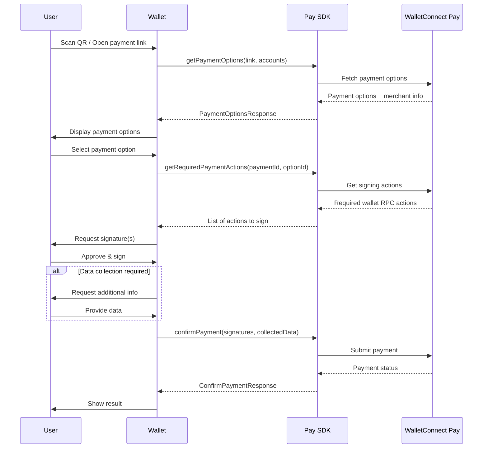

The WalletConnect Pay SDK is a TypeScript SDK for WalletConnect Pay that enables payment functionality for React Native wallet applications. The SDK uses a provider abstraction that allows different implementations based on your environment.

## Requirements

- React Native 0.70+
- `@walletconnect/react-native-compat` installed and linked

## Installation

Install the WalletConnect Pay SDK using npm or yarn:

<Tabs>
<Tab title="npm">
```bash
npm install @walletconnect/pay
```
</Tab>
<Tab title="yarn">
```bash
yarn add @walletconnect/pay
```
</Tab>
</Tabs>

### React Native Setup

This SDK requires the WalletConnect React Native native module. Make sure you have `@walletconnect/react-native-compat` installed and linked in your React Native project:

```bash
npm install @walletconnect/react-native-compat
```

## Architecture

The SDK uses a provider abstraction that allows different implementations:

- **NativeProvider**: Uses React Native uniffi module (current)
- **WasmProvider**: Uses WebAssembly module (coming soon for web browsers)

The SDK auto-detects the best available provider for your environment.

## Configuration

Initialize the WalletConnect Pay client with your credentials:

```typescript
import { WalletConnectPay } from "@walletconnect/pay";

const client = new WalletConnectPay({
  projectId: "your-project-id",
  apiKey: "your-api-key",
});
```

### Configuration Parameters

| Parameter | Type | Required | Description |
|-----------|------|----------|-------------|
| `projectId` | `string` | Yes | Your WalletConnect Cloud project ID |
| `apiKey` | `string` | Yes | Your WalletConnect Pay API key |
| `baseUrl` | `string` | No | Custom API base URL |
| `logger` | `Logger` | No | Custom logger instance or level |

<Info>
Don't have a project ID? Create one at the [WalletConnect Dashboard](https://dashboard.walletconnect.com) by signing up and creating a new project.
</Info>

## Supported Networks

WalletConnect Pay currently supports the following networks with USDC:

| Network | Chain ID | CAIP-10 Format |
|---------|----------|----------------|
| Ethereum | 1 | `eip155:1:{address}` |
| Base | 8453 | `eip155:8453:{address}` |
| Optimism | 10 | `eip155:10:{address}` |
| Polygon | 137 | `eip155:137:{address}` |
| Arbitrum | 42161 | `eip155:42161:{address}` |

<Note>
Support for all EVM chains, Solana, and additional native and non-native assets is coming soon. Include accounts for all supported networks to maximize payment options for your users.
</Note>

## Payment Flow

The payment flow consists of four main steps:

**Get Options → Get Actions → Sign Actions → Confirm Payment**



<Steps>

<Step title="Get Payment Options" titleSize="h3">

When a user scans a payment QR code or opens a payment link, fetch available payment options:

```typescript
const options = await client.getPaymentOptions({
  paymentLink: "https://pay.walletconnect.com/pay_123",
  accounts: [
    `eip155:1:${walletAddress}`,      // Ethereum Mainnet
    `eip155:137:${walletAddress}`,    // Polygon
    `eip155:8453:${walletAddress}`,   // Base
    `eip155:42161:${walletAddress}`,  // Arbitrum
  ],
  includePaymentInfo: true,
});

console.log("Payment ID:", options.paymentId);
console.log("Options:", options.options);

// Display merchant info
if (options.info) {
  console.log("Merchant:", options.info.merchant.name);
  console.log("Amount:", options.info.amount.display.assetSymbol, options.info.amount.value);
}

// Check if user data collection is required
if (options.collectData) {
  console.log("Required fields:", options.collectData.fields);
}
```

</Step>

<Step title="Get Required Actions" titleSize="h3">

After the user selects a payment option, get the wallet RPC actions required to complete the payment:

```typescript
const actions = await client.getRequiredPaymentActions({
  paymentId: options.paymentId,
  optionId: options.options[0].id,
});

// Each action contains wallet RPC data to sign
for (const action of actions) {
  console.log("Chain:", action.walletRpc.chainId);
  console.log("Method:", action.walletRpc.method);
  console.log("Params:", action.walletRpc.params);
}
```

</Step>

<Step title="Sign Actions" titleSize="h3">

Sign each action with your wallet's signing implementation:

```typescript
// Sign each action with your wallet (implementation depends on your wallet SDK)
const signatures = await Promise.all(
  actions.map((action) =>
    wallet.signTypedData(
      action.walletRpc.chainId,
      JSON.parse(action.walletRpc.params)
    )
  )
);
```

<Warning>
Signatures must be in the same order as the actions array.
</Warning>

</Step>

<Step title="Collect User Data (If Required)" titleSize="h3">

Some payments may require additional user data. Check for `collectData` in the payment options response:

```typescript
let collectedData: CollectDataFieldResult[] | undefined;

if (options.collectData) {
  // Show UI to collect required fields
  collectedData = options.collectData.fields.map((field) => ({
    id: field.id,
    value: getUserInput(field.name, field.fieldType),
  }));
}
```

</Step>

<Step title="Confirm Payment" titleSize="h3">

Submit the signatures and collected data to complete the payment:

```typescript
const result = await client.confirmPayment({
  paymentId: options.paymentId,
  optionId: options.options[0].id,
  signatures,
  collectedData, // Include if collectData was present
});

if (result.status === "succeeded") {
  console.log("Payment successful!");
} else if (result.status === "processing") {
  console.log("Payment is processing...");
} else if (result.status === "failed") {
  console.log("Payment failed");
}
```

</Step>

</Steps>

## Complete Example

Here's a complete implementation example:

```typescript
import { WalletConnectPay, CollectDataFieldResult } from "@walletconnect/pay";

class PaymentManager {
  private client: WalletConnectPay;

  constructor() {
    this.client = new WalletConnectPay({
      projectId: "your-project-id",
      apiKey: "your-api-key",
    });
  }

  async processPayment(paymentLink: string, walletAddress: string) {
    try {
      // Step 1: Get payment options
      const options = await this.client.getPaymentOptions({
        paymentLink,
        accounts: [
          `eip155:1:${walletAddress}`,
          `eip155:137:${walletAddress}`,
          `eip155:8453:${walletAddress}`,
        ],
        includePaymentInfo: true,
      });

      if (options.options.length === 0) {
        throw new Error("No payment options available");
      }

      // Step 2: Let user select an option (simplified - use first option)
      const selectedOption = options.options[0];

      // Step 3: Get required actions
      const actions = await this.client.getRequiredPaymentActions({
        paymentId: options.paymentId,
        optionId: selectedOption.id,
      });

      // Step 4: Sign all actions
      const signatures = await Promise.all(
        actions.map((action) =>
          this.signAction(action, walletAddress)
        )
      );

      // Step 5: Collect user data if required
      let collectedData: CollectDataFieldResult[] | undefined;
      if (options.collectData) {
        collectedData = await this.collectUserData(options.collectData.fields);
      }

      // Step 6: Confirm payment
      const result = await this.client.confirmPayment({
        paymentId: options.paymentId,
        optionId: selectedOption.id,
        signatures,
        collectedData,
      });

      return result;
    } catch (error) {
      console.error("Payment failed:", error);
      throw error;
    }
  }

  private async signAction(action: Action, walletAddress: string): Promise<string> {
    const { chainId, method, params } = action.walletRpc;
    
    // Use your wallet's signing implementation
    return await wallet.signTypedData(chainId, JSON.parse(params));
  }

  private async collectUserData(fields: CollectDataField[]): Promise<CollectDataFieldResult[]> {
    // Implement your UI to collect user data
    return fields.map((field) => ({
      id: field.id,
      value: getUserInput(field.name, field.fieldType),
    }));
  }
}
```

## Provider Utilities

The SDK provides utilities for checking provider availability:

```typescript
import {
  isProviderAvailable,
  detectProviderType,
  isNativeProviderAvailable,
  setNativeModule,
} from "@walletconnect/pay";

// Check if any provider is available
if (isProviderAvailable()) {
  // SDK can be used
}

// Detect which provider type is available
const providerType = detectProviderType(); // 'native' | 'wasm' | null

// Check specifically for native provider
if (isNativeProviderAvailable()) {
  // React Native native module is available
}

// Manually inject native module (if auto-discovery fails)
import { NativeModules } from "react-native";
setNativeModule(NativeModules.RNWalletConnectPay);
```

## Error Handling

The SDK throws typed errors for different failure scenarios:

```typescript
import { 
  PayError, 
  PaymentOptionsError, 
  PaymentActionsError,
  ConfirmPaymentError,
  NativeModuleNotFoundError 
} from "@walletconnect/pay";

try {
  const options = await client.getPaymentOptions({
    paymentLink: link,
    accounts,
  });
} catch (error) {
  if (error instanceof PaymentOptionsError) {
    console.error("Failed to get options:", error.originalMessage);
  } else if (error instanceof PayError) {
    console.error("Pay error:", error.code, error.message);
  }
}
```

### Error Types

| Error Class | Description |
|-------------|-------------|
| `PayError` | Base error class for all Pay SDK errors |
| `PaymentOptionsError` | Error when fetching payment options |
| `PaymentActionsError` | Error when fetching required payment actions |
| `ConfirmPaymentError` | Error when confirming payment |
| `NativeModuleNotFoundError` | Error when native module is not available |

### Error Codes

The `PayError` class includes a `code` property with one of the following values:

```typescript
type PayErrorCode =
  | "JSON_PARSE"
  | "JSON_SERIALIZE"
  | "PAYMENT_OPTIONS"
  | "PAYMENT_REQUEST"
  | "CONFIRM_PAYMENT"
  | "NATIVE_MODULE_NOT_FOUND"
  | "INITIALIZATION_ERROR"
  | "UNKNOWN";
```

## API Reference

### WalletConnectPay

Main client for payment operations.

#### Constructor

```typescript
new WalletConnectPay(options: WalletConnectPayOptions)
```

#### Methods

| Method | Description |
|--------|-------------|
| `getPaymentOptions(params)` | Fetch available payment options |
| `getRequiredPaymentActions(params)` | Get signing actions for a payment option |
| `confirmPayment(params)` | Confirm and execute the payment |
| `static isAvailable()` | Check if a provider is available |

### Data Types

#### PaymentStatus

```typescript
type PaymentStatus = 
  | "requires_action" 
  | "processing" 
  | "succeeded" 
  | "failed" 
  | "expired";
```

#### PayProviderType

```typescript
type PayProviderType = "native" | "wasm";
```

#### CollectDataFieldType

```typescript
type CollectDataFieldType = "text" | "date";
```

#### Method Parameters

```typescript
interface GetPaymentOptionsParams {
  /** Payment link or ID */
  paymentLink: string;
  /** List of CAIP-10 accounts */
  accounts: string[];
  /** Whether to include payment info in response */
  includePaymentInfo?: boolean;
}

interface GetRequiredPaymentActionsParams {
  /** Payment ID */
  paymentId: string;
  /** Option ID */
  optionId: string;
}

interface ConfirmPaymentParams {
  /** Payment ID */
  paymentId: string;
  /** Option ID */
  optionId: string;
  /** Signatures from wallet RPC calls */
  signatures: string[];
  /** Collected data fields (if required) */
  collectedData?: CollectDataFieldResult[];
}
```

#### Response Types

```typescript
interface PaymentOptionsResponse {
  /** Payment ID extracted from the payment link */
  paymentId: string;
  /** Payment information (if includePaymentInfo was true) */
  info?: PaymentInfo;
  /** Available payment options */
  options: PaymentOption[];
  /** Data collection requirements (if any) */
  collectData?: CollectDataAction;
}

interface ConfirmPaymentResponse {
  /** Payment status */
  status: PaymentStatus;
  /** True if the payment is in a final state */
  isFinal: boolean;
  /** Time to poll for payment status, in milliseconds */
  pollInMs?: number;
}
```

#### PaymentOption

```typescript
interface PaymentOption {
  /** ID of the option */
  id: string;
  /** The option's token and amount */
  amount: PayAmount;
  /** Estimated time to complete the option, in seconds */
  etaS: number;
  /** Actions required to complete the option */
  actions: Action[];
}
```

#### Action

```typescript
interface Action {
  walletRpc: WalletRpcAction;
}

interface WalletRpcAction {
  /** Chain ID in CAIP-2 format (e.g., "eip155:8453") */
  chainId: string;
  /** RPC method name (e.g., "eth_signTypedData_v4") */
  method: string;
  /** JSON-encoded params array */
  params: string;
}
```

#### Amount Types

```typescript
interface PayAmount {
  /** Currency unit, prefixed with either "iso4217/" or "caip19/" */
  unit: string;
  /** Amount value, in the currency unit's minor units */
  value: string;
  /** Display information for the amount */
  display: AmountDisplay;
}

interface AmountDisplay {
  /** Ticker/symbol of the asset */
  assetSymbol: string;
  /** Full name of the asset */
  assetName: string;
  /** Number of minor decimals of the asset */
  decimals: number;
  /** URL of the icon of the asset (if token) */
  iconUrl?: string;
  /** Name of the network of the asset (if token) */
  networkName?: string;
}
```

#### Payment Info Types

```typescript
interface PaymentInfo {
  /** Payment status */
  status: PaymentStatus;
  /** Amount to be paid */
  amount: PayAmount;
  /** Payment expiration timestamp, in seconds since epoch */
  expiresAt: number;
  /** Merchant information */
  merchant: MerchantInfo;
  /** Buyer information (present if payment has been submitted) */
  buyer?: BuyerInfo;
}

interface MerchantInfo {
  /** Merchant name */
  name: string;
  /** Merchant icon URL */
  iconUrl?: string;
}

interface BuyerInfo {
  /** Account CAIP-10 */
  accountCaip10: string;
  /** Account provider name */
  accountProviderName: string;
  /** Account provider icon URL */
  accountProviderIcon?: string;
}
```

#### Collect Data Types

```typescript
interface CollectDataAction {
  fields: CollectDataField[];
}

interface CollectDataField {
  /** ID of the field for submission */
  id: string;
  /** Human readable name of the field */
  name: string;
  /** Whether the field is required */
  required: boolean;
  /** Type of the field */
  fieldType: CollectDataFieldType;
}

interface CollectDataFieldResult {
  id: string;
  value: string;
}
```

## Best Practices

1. **Check Provider Availability**: Always check if a provider is available before using the SDK

2. **Account Format**: Always use CAIP-10 format for accounts: `eip155:{chainId}:{address}`

3. **Multiple Chains**: Provide accounts for all supported chains to maximize payment options

4. **Signature Order**: Maintain the same order of signatures as the actions array

5. **Error Handling**: Always handle errors gracefully and show appropriate user feedback

6. **Loading States**: Show loading indicators during API calls and signing operations

7. **User Data**: Only collect data when `collectData` is present in the response
