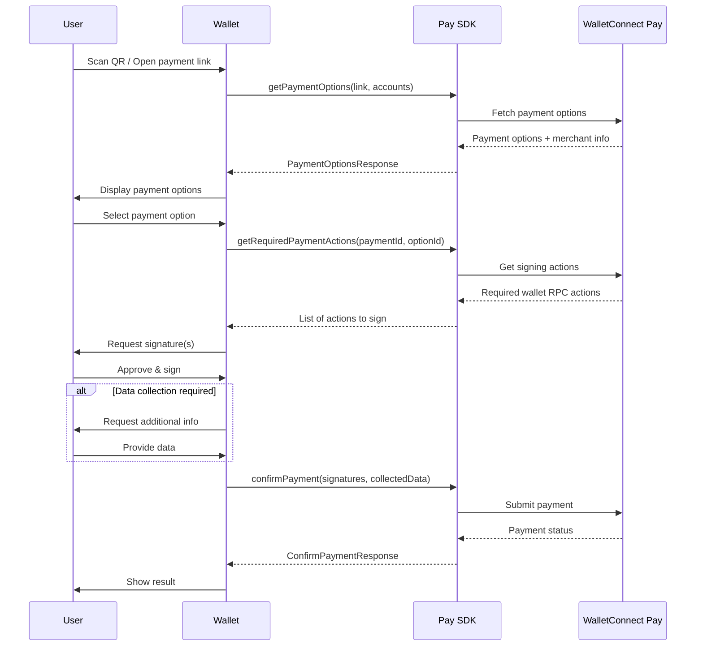

The WalletConnect Pay SDK allows wallet users to pay merchants using their crypto assets. The SDK handles payment option discovery, permit signing coordination, and payment confirmation while leveraging your wallet's existing signing infrastructure.

## Requirements

- Flutter 3.0+
- iOS 13.0+
- Android API 23+

## Installation

Add `walletconnect_pay` package to your `pubspec.yaml` or simply run:

```bash
flutter pub add walletconnect_pay
```

## Configuration

Initialize the `WalletConnectPay` client with your app ID and client ID or API key:

```dart
import 'package:walletconnect_pay/walletconnect_pay.dart';

// Initialize WalletConnect Pay. Either apiKey or appId must be passed
final payClient = WalletConnectPay(
  apiKey: 'YOUR_API_KEY', // Optional
  appId: 'YOUR_APP_ID', // Optional
  clientId: 'OPTIONAL_CLIENT_ID', // Optional
  baseUrl: 'https://api.pay.walletconnect.com', // Optional
);

// Initialize the SDK
try {
  await payClient.init();
} on PayInitializeError catch (e) {
  // Handle initialization error
}
```

### Configuration Parameters

| Parameter | Type | Required | Description |
|-----------|------|----------|-------------|
| `apiKey` | `String?` | No* | WalletConnect Pay API key |
| `appId` | `String?` | No* | WalletConnect app ID |
| `clientId` | `String?` | No | Client identifier |
| `baseUrl` | `String?` | No | Base URL for the API (defaults to production) |

<Note>
Either `apiKey` or `appId` must be provided for authentication.
</Note>

<Info>
Don't have a project ID? Create one at the [WalletConnect Dashboard](https://dashboard.walletconnect.com) by signing up and creating a new project.
</Info>

## Supported Networks

WalletConnect Pay currently supports the following networks with USDC:

| Network | Chain ID | CAIP-10 Format |
|---------|----------|----------------|
| Ethereum | 1 | `eip155:1:{address}` |
| Base | 8453 | `eip155:8453:{address}` |
| Optimism | 10 | `eip155:10:{address}` |
| Polygon | 137 | `eip155:137:{address}` |
| Arbitrum | 42161 | `eip155:42161:{address}` |

<Note>
Support for all EVM chains, Solana, and additional native and non-native assets is coming soon. Include accounts for all supported networks to maximize payment options for your users.
</Note>

## Payment Flow

The payment flow consists of four main steps:

**Get Options -> Get Actions -> Sign Actions -> Confirm Payment**



<Steps>

<Step title="Get Payment Options" titleSize="h3">

Retrieve available payment options for a payment link:

```dart
final request = GetPaymentOptionsRequest(
  paymentLink: 'https://pay.walletconnect.com/pay_123',
  accounts: ['eip155:1:0x...', 'eip155:137:0x...'], // User's wallet CAIP-10 accounts
  includePaymentInfo: true, // Include payment details in response
);

final response = await payClient.getPaymentOptions(request: request);

// Access payment information
print('Payment ID: ${response.paymentId}');
print('Options available: ${response.options.length}');

if (response.info != null) {
  print('Amount: ${response.info!.amount.formatAmount()}');
  print('Status: ${response.info!.status}');
  print('Merchant: ${response.info!.merchant.name}');
}

// Check if data collection is required
if (response.collectData != null) {
  print('Data collection required: ${response.collectData!.fields.length} fields');
}
```

</Step>

<Step title="Get Required Payment Actions" titleSize="h3">

Get the required wallet actions (e.g., transactions to sign) for a selected payment option:

```dart
final actionsRequest = GetRequiredPaymentActionsRequest(
  optionId: response.options.first.id, // Or whatever other option chosen by the user
  paymentId: response.paymentId,
);
final actions = await payClient.getRequiredPaymentActions(
  request: actionsRequest,
);

// Process each action (e.g., sign transactions)
for (final action in actions) {
  final walletRpc = action.walletRpc;
  print('Chain ID: ${walletRpc.chainId}');
  print('Method: ${walletRpc.method}');
  print('Params: ${walletRpc.params}');
  
  // Sign the transaction using your wallet SDK
  // final signature = await signTransaction(walletRpc);
}
```

</Step>

<Step title="Collect User Data (If Required)" titleSize="h3">

Some payments may require additional user data. Check for `collectData` in the payment options response:

```dart
List<CollectDataFieldResult>? collectedData;

if (response.collectData != null) {
  collectedData = response.collectData!.fields.map((field) {
    return CollectDataFieldResult(
      id: field.id,
      value: getUserInput(field.name, field.fieldType),
    );
  }).toList();
}
```

</Step>

<Step title="Confirm Payment" titleSize="h3">

Confirm a payment with signatures and optional collected data:

```dart
final confirmRequest = ConfirmPaymentRequest(
  paymentId: response.paymentId,
  optionId: response.options.first.id,
  signatures: ['0x...', '0x...'], // Signatures from wallet actions
  collectedData: [
    CollectDataFieldResult(
      id: 'fullName',
      value: 'John Doe',
    ),
    CollectDataFieldResult(
      id: 'dob',
      value: '1990-01-01',
    ),
  ], // Optional: if data collection was required
  maxPollMs: 60000, // Optional: max polling time in milliseconds
);

final confirmResponse = await payClient.confirmPayment(request: confirmRequest);

print('Payment Status: ${confirmResponse.status}');
print('Is Final status: ${confirmResponse.isFinal}');

if (!confirmResponse.isFinal && confirmResponse.pollInMs != null) {
  // Poll again after the specified interval
  await Future.delayed(Duration(milliseconds: confirmResponse.pollInMs!));
  // Re-confirm or check status
}
```

</Step>

</Steps>

## Complete Example

Here's a complete implementation example:

```dart
import 'package:walletconnect_pay/walletconnect_pay.dart';

class PaymentService {
  late final WalletConnectPay _payClient;

  Future<void> initialize() async {
    _payClient = WalletConnectPay(
      appId: 'YOUR_APP_ID',
    );
    await _payClient.init();
  }

  Future<ConfirmPaymentResponse> processPayment(
    String paymentLink,
    List<String> accounts,
  ) async {
    // Step 1: Get payment options
    final optionsResponse = await _payClient.getPaymentOptions(
      request: GetPaymentOptionsRequest(
        paymentLink: paymentLink,
        accounts: accounts,
        includePaymentInfo: true,
      ),
    );

    if (optionsResponse.options.isEmpty) {
      throw Exception('No payment options available');
    }

    // Step 2: Select payment option (simplified - use first option)
    final selectedOption = optionsResponse.options.first;

    // Step 3: Get required payment actions
    final actions = await _payClient.getRequiredPaymentActions(
      request: GetRequiredPaymentActionsRequest(
        optionId: selectedOption.id,
        paymentId: optionsResponse.paymentId,
      ),
    );

    // Step 4: Sign all actions
    final signatures = <String>[];
    for (final action in actions) {
      final signature = await signTransaction(action.walletRpc);
      signatures.add(signature);
    }

    // Step 5: Collect user data if required
    List<CollectDataFieldResult>? collectedData;
    if (optionsResponse.collectData != null) {
      collectedData = await collectUserData(optionsResponse.collectData!.fields);
    }

    // Step 6: Confirm payment
    final confirmResponse = await _payClient.confirmPayment(
      request: ConfirmPaymentRequest(
        paymentId: optionsResponse.paymentId,
        optionId: selectedOption.id,
        signatures: signatures,
        collectedData: collectedData,
        maxPollMs: 60000,
      ),
    );

    // Step 7: Poll until final status (if needed)
    var response = confirmResponse;
    while (!response.isFinal && response.pollInMs != null) {
      await Future.delayed(Duration(milliseconds: response.pollInMs!));
      response = await _payClient.confirmPayment(
        request: ConfirmPaymentRequest(
          paymentId: optionsResponse.paymentId,
          optionId: selectedOption.id,
          signatures: signatures,
          collectedData: collectedData,
          maxPollMs: 60000,
        ),
      );
    }

    return response;
  }

  Future<String> signTransaction(WalletRpcAction walletRpc) async {
    // Implement your wallet's signing logic
    // Use walletRpc.chainId, walletRpc.method, walletRpc.params
    throw UnimplementedError('Implement signing logic');
  }

  Future<List<CollectDataFieldResult>> collectUserData(
    List<CollectDataField> fields,
  ) async {
    // Implement your UI to collect user data
    return fields.map((field) {
      return CollectDataFieldResult(
        id: field.id,
        value: getUserInput(field),
      );
    }).toList();
  }
}
```

## API Reference

### WalletConnectPay

The main class for interacting with the WalletConnect Pay SDK.

#### Constructor

```dart
WalletConnectPay({
  String? apiKey,
  String? appId,
  String? clientId,
  String? baseUrl,
})
```

#### Methods

| Method | Description |
|--------|-------------|
| `Future<bool> init()` | Initializes the SDK. Returns `true` on success or throw `PayInitializeError` on error |
| `Future<PaymentOptionsResponse> getPaymentOptions({required GetPaymentOptionsRequest request})` | Retrieves available payment options |
| `Future<List<Action>> getRequiredPaymentActions({required GetRequiredPaymentActionsRequest request})` | Gets the required wallet actions for a selected option (to be called if the selected option does not have actions included) |
| `Future<ConfirmPaymentResponse> confirmPayment({required ConfirmPaymentRequest request})` | Confirms a payment |

## Models

### GetPaymentOptionsRequest

```dart
GetPaymentOptionsRequest({
  required String paymentLink,
  required List<String> accounts,
  @Default(false) bool includePaymentInfo,
})
```

### PaymentOptionsResponse

```dart
PaymentOptionsResponse({
  required String paymentId,
  PaymentInfo? info,
  required List<PaymentOption> options,
  CollectDataAction? collectData,
})
```

### PaymentInfo

```dart
PaymentInfo({
  required PaymentStatus status,
  required PayAmount amount,
  required int expiresAt,
  required MerchantInfo merchant,
  BuyerInfo? buyer,
})
```

### PaymentOption

```dart
PaymentOption({
  required String id,
  required String account,
  required PayAmount amount,
  @JsonKey(name: 'etaS') required int etaSeconds,
  required List<Action> actions,
})
```

### ConfirmPaymentRequest

```dart
ConfirmPaymentRequest({
  required String paymentId,
  required String optionId,
  required List<String> signatures,
  List<CollectDataFieldResult>? collectedData,
  int? maxPollMs,
})
```

### ConfirmPaymentResponse

```dart
ConfirmPaymentResponse({
  required PaymentStatus status,
  required bool isFinal,
  int? pollInMs,
})
```

### PaymentStatus

```dart
enum PaymentStatus {
  requires_action,
  processing,
  succeeded,
  failed,
  expired,
}
```

### Action & WalletRpcAction

```dart
class Action {
  final WalletRpcAction walletRpc;
}

class WalletRpcAction {
  final String chainId;   // CAIP-2 chain ID (e.g., "eip155:8453")
  final String method;    // RPC method (e.g., "eth_signTypedData_v4")
  final String params;    // JSON-encoded parameters
}
```

### CollectDataField & CollectDataFieldResult

```dart
class CollectDataField {
  final String id;
  final String name;
  final bool required;
  final CollectDataFieldType fieldType;
}

class CollectDataFieldResult {
  final String id;
  final String value;
}

enum CollectDataFieldType {
  text,
  date,
}
```

## Error Handling

The SDK throws specific exception types for different error scenarios. All errors extend the abstract `PayError` class, which itself extends `PlatformException`:

```dart
abstract class PayError extends PlatformException {
  PayError({
    required super.code,
    required super.message,
    required super.details,
    required super.stacktrace,
  });
}
```

| Exception | Description |
|-----------|-------------|
| `PayInitializeError` | Initialization failures |
| `GetPaymentOptionsError` | Errors when fetching payment options |
| `GetRequiredActionsError` | Errors when getting required actions |
| `ConfirmPaymentError` | Errors when confirming payment |

All errors include:
- `code`: Error code
- `message`: Error message
- `details`: Additional error details
- `stacktrace`: Stack trace

### Example Error Handling

```dart
try {
  await payClient.init();
} on PayInitializeError catch (e) {
  print('Initialization failed: ${e.code} - ${e.message}');
}

try {
  final response = await payClient.getPaymentOptions(request: request);
} on GetPaymentOptionsError catch (e) {
  print('Error code: ${e.code}');
  print('Error message: ${e.message}');
} on PayError catch (e) {
  // Catch any Pay-related error
  print('Pay error: ${e.message}');
} catch (e) {
  print('Unexpected error: $e');
}
```

## Best Practices

1. **Initialize once**: Call `init()` only once, typically during app startup

2. **Account Format**: Always use CAIP-10 format for accounts: `eip155:{chainId}:{address}`

3. **Multiple Chains**: Provide accounts for all supported chains to maximize payment options

4. **Signature Order**: Maintain the same order of signatures as the actions array

5. **Error Handling**: Always handle errors gracefully and show appropriate user feedback

6. **Loading States**: Show loading indicators during API calls and signing operations

7. **Expiration**: Check `paymentInfo.expiresAt` and warn users if time is running low

8. **User Data**: Only collect data when `collectData` is present in the response and you don't already have the required user data. If you already have the required data, you can submit this without collecting from the user. You must make sure the user accepts WalletConnect Terms and Conditions and Privacy Policy before submitting user information to WalletConnect.

## Examples

For a complete example implementation, see the [reown_walletkit example](https://github.com/reown-com/reown_flutter/tree/master/packages/reown_walletkit/example/lib/walletconnect_pay).
