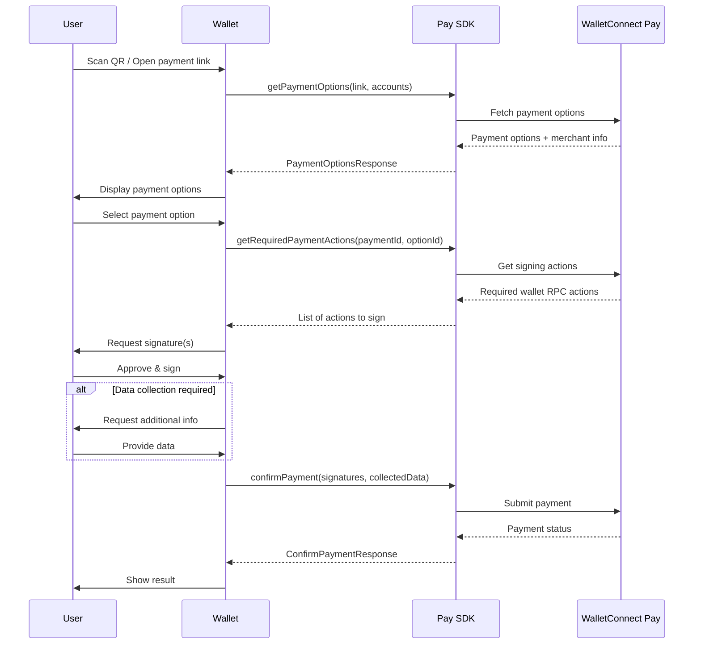

The WalletConnect Pay SDK allows wallet users to pay merchants using their crypto assets. The SDK handles payment option discovery, permit signing coordination, and payment confirmation while leveraging your wallet's existing signing infrastructure.

## Requirements

- iOS 13.0+
- Swift 5.7+
- Xcode 14.0+

## Installation

### Swift Package Manager

Add WalletConnectPay to your `Package.swift`:

```swift
dependencies: [
    .package(url: "https://github.com/reown-com/reown-swift", from: "1.0.0")
]
```

Then add `WalletConnectPay` to your target dependencies:

```swift
.target(
    name: "YourApp",
    dependencies: ["WalletConnectPay"]
)
```

<Info>
The version shown above may not be the latest. Check the [GitHub releases](https://github.com/reown-com/reown-swift/releases) for the most recent version.
</Info>

## Configuration

Configure the Pay client during app initialization, typically in your `AppDelegate` or `SceneDelegate`:

```swift
import WalletConnectPay

func application(_ application: UIApplication, didFinishLaunchingWithOptions...) {
    // Option 1: With appId (recommended for wallets)
    WalletConnectPay.configure(
        appId: "your-walletconnect-project-id",
        logging: true
    )
    
    // Option 2: With API key
    WalletConnectPay.configure(
        apiKey: "your-pay-api-key"
    )
}
```

### Configuration Parameters

| Parameter | Type | Required | Default | Description |
|-----------|------|----------|---------|-------------|
| `apiKey` | `String?` | No* | `nil` | Your WalletConnect Pay API key |
| `appId` | `String?` | No* | `nil` | Your WalletConnect project ID |
| `baseUrl` | `String` | No | Production URL | Custom API URL |
| `logging` | `Bool` | No | `false` | Enable debug logging |

<Note>
At least one of `apiKey` or `appId` must be provided.
</Note>

<Info>
Don't have a project ID? Create one at the [WalletConnect Dashboard](https://dashboard.walletconnect.com) by signing up and creating a new project.
</Info>

## Supported Networks

WalletConnect Pay currently supports USDC payments on the following networks:

| Network | Chain ID | CAIP-10 Format |
|---------|----------|----------------|
| Ethereum | 1 | `eip155:1:{address}` |
| Base | 8453 | `eip155:8453:{address}` |
| Optimism | 10 | `eip155:10:{address}` |
| Polygon | 137 | `eip155:137:{address}` |
| Arbitrum | 42161 | `eip155:42161:{address}` |

<Note>
Support for all EVM chains, Solana, and additional native and non-native assets is coming soon. Include accounts for all supported networks to maximize payment options for your users.
</Note>

## Detecting Payment Links

The `isPaymentLink` utility method detects WalletConnect Pay links by checking for:
- `pay.` hosts (e.g., pay.walletconnect.com)
- `pay=` parameter in WalletConnect URIs
- `pay_` prefix in bare payment IDs

```swift
func isPaymentLink(_ string: String) -> Bool {
    let lower = string.lowercased()
    return lower.contains("pay.") ||
           lower.contains("pay=") ||
           lower.contains("pay_")
}
```

## Payment Flow

The payment flow consists of four main steps:

**Get Options -> Get Actions -> Sign Permit -> Confirm Payment**



<Steps>

<Step title="Get Payment Options" titleSize="h3">

When a user scans a payment QR code or opens a payment link, fetch available payment options:

```swift
let paymentLink = "https://pay.walletconnect.com/?pid=pay_abc123..."

// Provide all user's EVM accounts in CAIP-10 format
let accounts = [
    "eip155:1:\(walletAddress)",      // Ethereum Mainnet
    "eip155:137:\(walletAddress)",    // Polygon
    "eip155:8453:\(walletAddress)",   // Base
    "eip155:42161:\(walletAddress)"   // Arbitrum
]

do {
    let response = try await WalletConnectPay.instance.getPaymentOptions(
        paymentLink: paymentLink,
        accounts: accounts
    )
    
    // Display merchant info
    if let info = response.info {
        print("Merchant: \(info.merchant.name)")
        print("Amount: \(info.amount.display.assetSymbol) \(info.amount.value)")
    }
    
    // Show available payment options to user
    for option in response.options {
        print("Pay with \(option.amount.display.assetSymbol) on \(option.amount.display.networkName ?? "Unknown")")
    }
    
    // Check if user data collection is required (travel rule)
    if let collectData = response.collectData {
        // Show UI to collect required user information
        for field in collectData.fields {
            print("Required field: \(field.name) (type: \(field.fieldType))")
        }
    }
    
} catch {
    print("Failed to get payment options: \(error)")
}
```

</Step>

<Step title="Get Required Actions" titleSize="h3">

After the user selects a payment option, get the signing actions:

```swift
let actions = try await WalletConnectPay.instance.getRequiredPaymentActions(
    paymentId: response.paymentId,
    optionId: selectedOption.id
)
```

</Step>

<Step title="Sign the Permit" titleSize="h3">

Each action contains a `walletRpc` with EIP-712 typed data that needs to be signed. The method is `eth_signTypedData_v4`.

```swift
var signatures: [String] = []

for action in actions {
    let rpc = action.walletRpc
    
    // rpc.chainId - The chain to sign on (e.g., "eip155:8453")
    // rpc.method  - "eth_signTypedData_v4"  
    // rpc.params  - JSON string: ["address", "{...typed data...}"]
    
    // Parse the params to extract typed data
    let paramsData = rpc.params.data(using: .utf8)!
    let params = try JSONSerialization.jsonObject(with: paramsData) as! [Any]
    let typedDataJson = params[1] as! String
    
    // Sign using your wallet's existing EIP-712 signing implementation
    let signature = try await yourWallet.signTypedData(
        typedData: typedDataJson,
        address: walletAddress,
        chainId: rpc.chainId
    )
    
    signatures.append(signature)
}
```

<Warning>
Signatures must be in the same order as the actions array.
</Warning>

</Step>

<Step title="Collect User Data (If Required)" titleSize="h3">

If `response.collectData` is not nil, you must collect user information before confirming:

```swift
var collectedData: [CollectDataFieldResult]? = nil

if let collectDataAction = response.collectData {
    collectedData = []
    
    for field in collectDataAction.fields {
        // Show appropriate UI based on field.fieldType
        let value: String
        
        switch field.fieldType {
        case .text:
            // Show text input for name fields
            value = userInputtedValue
        case .date:
            // Show date picker for date of birth
            // Format: "YYYY-MM-DD"
            value = "1990-01-15"
        }
        
        collectedData?.append(CollectDataFieldResult(
            id: field.id,
            value: value
        ))
    }
}
```

</Step>

<Step title="Confirm Payment" titleSize="h3">

Submit the signatures and collected data to complete the payment:

```swift
let result = try await WalletConnectPay.instance.confirmPayment(
    paymentId: response.paymentId,
    optionId: selectedOption.id,
    signatures: signatures,
    collectedData: collectedData,
    maxPollMs: 60000  // Wait up to 60 seconds for confirmation
)

switch result.status {
case .succeeded:
    print("Payment successful!")
case .processing:
    print("Payment is being processed...")
case .failed:
    print("Payment failed")
case .expired:
    print("Payment expired")
case .requiresAction:
    print("Additional action required")
}
```

</Step>

</Steps>

## Complete Example

Here's a complete implementation example:

```swift
import WalletConnectPay

class PaymentManager {
    
    func processPayment(
        paymentLink: String,
        walletAddress: String,
        signer: YourSignerProtocol
    ) async throws {
        
        // 1. Get payment options
        let accounts = [
            "eip155:1:\(walletAddress)",
            "eip155:137:\(walletAddress)",
            "eip155:8453:\(walletAddress)"
        ]
        
        let optionsResponse = try await WalletConnectPay.instance.getPaymentOptions(
            paymentLink: paymentLink,
            accounts: accounts
        )
        
        guard !optionsResponse.options.isEmpty else {
            throw PaymentError.noOptionsAvailable
        }
        
        // 2. Let user select an option (simplified - use first option)
        let selectedOption = optionsResponse.options[0]
        
        // 3. Get required actions
        let actions = try await WalletConnectPay.instance.getRequiredPaymentActions(
            paymentId: optionsResponse.paymentId,
            optionId: selectedOption.id
        )
        
        // 4. Sign all actions
        var signatures: [String] = []
        for action in actions {
            let signature = try await signTypedData(
                action: action,
                walletAddress: walletAddress,
                signer: signer
            )
            signatures.append(signature)
        }
        
        // 5. Collect user data if required
        var collectedData: [CollectDataFieldResult]? = nil
        if let collectData = optionsResponse.collectData {
            collectedData = try await collectUserData(fields: collectData.fields)
        }
        
        // 6. Confirm payment
        let result = try await WalletConnectPay.instance.confirmPayment(
            paymentId: optionsResponse.paymentId,
            optionId: selectedOption.id,
            signatures: signatures,
            collectedData: collectedData
        )
        
        guard result.status == .succeeded else {
            throw PaymentError.paymentFailed(result.status)
        }
    }
    
    private func signTypedData(
        action: Action,
        walletAddress: String,
        signer: YourSignerProtocol
    ) async throws -> String {
        let rpc = action.walletRpc
        
        // Parse params: ["address", "typedDataJson"]
        guard let paramsData = rpc.params.data(using: .utf8),
              let params = try JSONSerialization.jsonObject(with: paramsData) as? [Any],
              params.count >= 2,
              let typedDataJson = params[1] as? String else {
            throw PaymentError.invalidParams
        }
        
        // Use your wallet's signing implementation
        return try await signer.signTypedData(
            data: typedDataJson,
            address: walletAddress
        )
    }
    
    private func collectUserData(
        fields: [CollectDataField]
    ) async throws -> [CollectDataFieldResult] {
        // Implement your UI to collect user data
        // This is typically done via a form/modal
        return fields.map { field in
            CollectDataFieldResult(
                id: field.id,
                value: getUserInput(for: field)
            )
        }
    }
}
```

## Deep Link Handling

To handle payment links opened from outside your app:

```swift
// In SceneDelegate or AppDelegate
func scene(_ scene: UIScene, openURLContexts URLContexts: Set<UIOpenURLContext>) {
    guard let url = URLContexts.first?.url else { return }
    
    if isPaymentLink(url.absoluteString) {
        startPaymentFlow(paymentLink: url.absoluteString)
    }
}
```

## QR Code Scanning

Payment links can be encoded as QR codes. Use the `isPaymentLink` utility for detection:

```swift
func handleScannedQR(_ content: String) {
    if isPaymentLink(content) {
        // WalletConnect Pay QR code
        startPaymentFlow(paymentLink: content)
    }
}
```

## Error Handling

The SDK throws specific error types for different failure scenarios:

### GetPaymentOptionsError

| Error | Description |
|-------|-------------|
| `.paymentNotFound` | Payment ID doesn't exist |
| `.paymentExpired` | Payment has expired |
| `.invalidRequest` | Invalid request parameters |
| `.invalidAccount` | Invalid account format |
| `.complianceFailed` | Compliance check failed |
| `.http` | Network error |
| `.internalError` | Server error |

### GetPaymentRequestError

| Error | Description |
|-------|-------------|
| `.optionNotFound` | Selected option doesn't exist |
| `.paymentNotFound` | Payment ID doesn't exist |
| `.invalidAccount` | Invalid account format |
| `.http` | Network error |

### ConfirmPaymentError

| Error | Description |
|-------|-------------|
| `.paymentNotFound` | Payment ID doesn't exist |
| `.paymentExpired` | Payment has expired |
| `.invalidOption` | Invalid option ID |
| `.invalidSignature` | Signature verification failed |
| `.routeExpired` | Payment route expired |
| `.http` | Network error |

## API Reference

### WalletConnectPay

Static configuration class for the Pay SDK.

| Method | Description |
|--------|-------------|
| `configure(apiKey:appId:baseUrl:logging:)` | Initialize the SDK with your credentials |
| `instance` | Access the shared `PayClient` instance |

### PayClient

Main client for payment operations.

| Method | Description |
|--------|-------------|
| `getPaymentOptions(paymentLink:accounts:includePaymentInfo:)` | Fetch available payment options |
| `getRequiredPaymentActions(paymentId:optionId:)` | Get signing actions for a payment option |
| `confirmPayment(paymentId:optionId:signatures:collectedData:maxPollMs:)` | Confirm and execute the payment |

### Data Types

#### PaymentOptionsResponse

```swift
struct PaymentOptionsResponse {
    let paymentId: String              // Unique payment identifier
    let info: PaymentInfo?             // Merchant and amount details
    let options: [PaymentOption]       // Available payment methods
    let collectData: CollectDataAction? // Required user data fields (travel rule)
}
```

#### PaymentInfo

```swift
struct PaymentInfo {
    let status: PaymentStatus          // Current payment status
    let amount: PayAmount              // Requested payment amount
    let expiresAt: Int64               // Expiration timestamp
    let merchant: MerchantInfo         // Merchant details
    let buyer: BuyerInfo?              // Buyer info if available
}
```

#### PaymentOption

```swift
struct PaymentOption {
    let id: String                     // Option identifier
    let amount: PayAmount              // Amount in this asset
    let etaS: Int64                    // Estimated time to complete (seconds)
    let actions: [Action]              // Required signing actions
}
```

#### PayAmount

```swift
struct PayAmount {
    let unit: String                   // Asset unit (e.g., "USDC")
    let value: String                  // Raw value in smallest unit
    let display: AmountDisplay         // Human-readable display info
}

struct AmountDisplay {
    let assetSymbol: String            // Token symbol (e.g., "USDC")
    let assetName: String              // Token name (e.g., "USD Coin")
    let decimals: Int64                // Token decimals
    let iconUrl: String?               // Token icon URL
    let networkName: String?           // Network name (e.g., "Base")
}
```

#### Action & WalletRpcAction

```swift
struct Action {
    let walletRpc: WalletRpcAction     // RPC call to sign
}

struct WalletRpcAction {
    let chainId: String                // Chain ID (e.g., "eip155:8453")
    let method: String                 // RPC method (eth_signTypedData_v4)
    let params: String                 // JSON-encoded parameters
}
```

#### CollectDataAction & CollectDataField

```swift
struct CollectDataAction {
    let fields: [CollectDataField]     // Required fields to collect
}

struct CollectDataField {
    let id: String                     // Field identifier
    let name: String                   // Display name
    let required: Bool                 // Whether field is required
    let fieldType: CollectDataFieldType // Type of input needed
}

enum CollectDataFieldType {
    case text                          // Text input (names, etc.)
    case date                          // Date input (format: YYYY-MM-DD)
}

struct CollectDataFieldResult {
    let id: String                     // Field identifier (from CollectDataField)
    let value: String                  // User-provided value
}
```

#### ConfirmPaymentResultResponse

```swift
struct ConfirmPaymentResultResponse {
    let status: PaymentStatus          // Final payment status
    let isFinal: Bool                  // Whether status is final
    let pollInMs: Int64?               // Suggested poll interval
}

enum PaymentStatus {
    case requiresAction                // Additional action needed
    case processing                    // Payment in progress
    case succeeded                     // Payment completed
    case failed                        // Payment failed
    case expired                       // Payment expired
}
```

## Best Practices

1. **Account Format**: Always use CAIP-10 format for accounts: `eip155:{chainId}:{address}`

2. **Multiple Chains**: Provide accounts for all supported chains to maximize payment options

3. **Signature Order**: Maintain the same order of signatures as the actions array

4. **Error Handling**: Always handle errors gracefully and show appropriate user feedback

5. **Loading States**: Show loading indicators during API calls and signing operations

6. **Expiration**: Check `paymentInfo.expiresAt` and warn users if time is running low

7. **User Data**: Only collect data when `collectData` is present in the response and you don't already have the required user data. If you already have the required data, you can submit this without collecting from the user. You must make sure the user accepts WalletConnect Terms and Conditions and Privacy Policy before submitting user information to WalletConnect.
