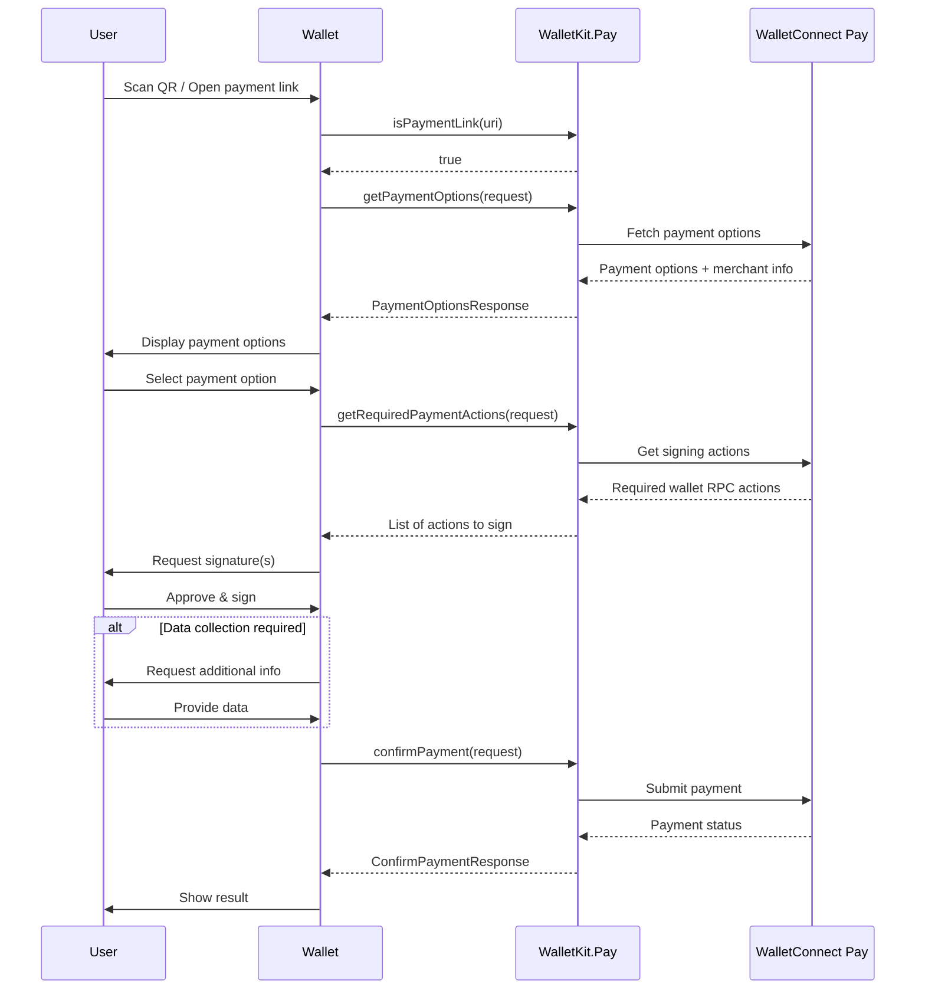

This documentation covers integrating WalletConnect Pay through ReownWalletKit. This approach provides a unified API where Pay is automatically initialized alongside WalletKit, simplifying the integration for wallet developers.

<Warning>
WalletConnect Pay via WalletKit is currently only available on React Native and requires `@walletconnect/react-native-compat` to be installed. Native Flutter support will be available soon.
</Warning>

## Requirements

- Flutter 3.0+
- iOS 13.0+
- Android API 23+
- ReownWalletKit

## Installation

Add `reown_walletkit` to your `pubspec.yaml`:

```yaml
dependencies:
  reown_walletkit: ^1.0.0
```

Then run:

```bash
flutter pub get
```

WalletConnectPay is automatically included as a dependency of ReownWalletKit.

<Info>
Check the [pub.dev page](https://pub.dev/packages/reown_walletkit) for the latest version.
</Info>

## Initialization

The `WalletConnectPay` client is automatically initialized during `ReownWalletKit.init()`. No additional setup is required.

```dart
import 'package:reown_walletkit/reown_walletkit.dart';

final walletKit = await ReownWalletKit.createInstance(
  projectId: 'YOUR_PROJECT_ID',
  metadata: PairingMetadata(
    name: 'My Wallet',
    description: 'My Wallet App',
    url: 'https://mywallet.com',
    icons: ['https://mywallet.com/icon.png'],
  ),
);
```

## Accessing the Pay Client

You can access the `WalletConnectPay` instance directly:

```dart
final payClient = walletKit.pay;
```

## Payment Link Detection

Detect if a URI is a payment link before processing:

```dart
if (walletKit.isPaymentLink(uri)) {
  // Handle as payment. See [Get Payment Options] section
} else {
  // Handle as regular WalletConnect pairing
  await walletKit.pair(uri: Uri.parse(uri));
}
```

## Payment Flow

The payment flow consists of five main steps:

**Detect Payment Link -> Get Options -> Get Actions -> Sign Actions -> Confirm Payment**



<Steps>

<Step title="Get Payment Options" titleSize="h3">

Retrieve available payment options for a payment link:

```dart
final response = await walletKit.getPaymentOptions(
  request: GetPaymentOptionsRequest(
    paymentLink: 'https://pay.walletconnect.com/pay_123',
    accounts: ['eip155:1:0x...', 'eip155:137:0x...'], // Wallet's CAIP-10 accounts
    includePaymentInfo: true,
  ),
);

print('Payment ID: ${response.paymentId}');
print('Options available: ${response.options.length}');

if (response.info != null) {
  print('Amount: ${response.info!.amount.formatAmount()}');
  print('Merchant: ${response.info!.merchant.name}');
}

// Check if data collection is required
if (response.collectData != null) {
  print('Data collection required: ${response.collectData!.fields.length} fields');
}
```

</Step>

<Step title="Get Required Payment Actions" titleSize="h3">

Get the required wallet actions for a selected payment option:

```dart
final actions = await walletKit.getRequiredPaymentActions(
  request: GetRequiredPaymentActionsRequest(
    optionId: 'option-id',
    paymentId: 'payment-id',
  ),
);

// Process each action (e.g., sign transactions)
for (final action in actions) {
  final walletRpc = action.walletRpc;
  print('Chain ID: ${walletRpc.chainId}');
  print('Method: ${walletRpc.method}');
  // Sign the transaction using your wallet SDK
}
```

</Step>

<Step title="Collect User Data (If Required)" titleSize="h3">

Some payments may require additional user data:

```dart
List<CollectDataFieldResult>? collectedData;

if (response.collectData != null) {
  collectedData = <CollectDataFieldResult>[];
  for (final field in response.collectData!.fields) {
    // Collect data from user (e.g., full name, date of birth)
    collectedData.add(CollectDataFieldResult(
      id: field.id,
      value: userInput,
    ));
  }
}
```

</Step>

<Step title="Confirm Payment" titleSize="h3">

Confirm the payment with signatures and optional collected data:

```dart
final confirmResponse = await walletKit.confirmPayment(
  request: ConfirmPaymentRequest(
    paymentId: 'payment-id',
    optionId: 'option-id',
    signatures: ['0x...', '0x...'], // Signatures from wallet actions
    collectedData: [
      CollectDataFieldResult(id: 'fullName', value: 'John Doe'),
      CollectDataFieldResult(id: 'dob', value: '1990-01-01'),
    ], // Optional: if data collection was required
    maxPollMs: 60000, // Maximum polling time in milliseconds
  ),
);

print('Payment Status: ${confirmResponse.status}');
print('Is Final: ${confirmResponse.isFinal}');
```

</Step>

</Steps>

## Complete Example

Here's a complete example of processing a payment:

```dart
import 'package:reown_walletkit/reown_walletkit.dart';

class PaymentService {
  final ReownWalletKit walletKit;

  PaymentService(this.walletKit);

  /// Process a payment from a payment link (e.g., after scanning QR code)
  Future<void> processPayment(String paymentLink) async {
    try {
      // Step 1: Get payment options
      final accounts = await getWalletAccounts(); // Your wallet accounts
      final optionsResponse = await walletKit.getPaymentOptions(
        request: GetPaymentOptionsRequest(
          paymentLink: paymentLink,
          accounts: accounts,
          includePaymentInfo: true,
        ),
      );

      if (optionsResponse.options.isEmpty) {
        throw Exception('No payment options available');
      }

      // Step 2: Collect additional data if required (KYB/KYC)
      final collectedData = <CollectDataFieldResult>[];
      if (optionsResponse.collectData != null) {
        for (final field in optionsResponse.collectData!.fields) {
          // Collect data from user (e.g., full name, date of birth)
          // Example: collectedData.add(CollectDataFieldResult(id: field.id, value: userInput));
        }
      }

      // Step 3: Select payment option (or let user choose)
      PaymentOption selectedOption = optionsResponse.options.first;
      final paymentId = optionsResponse.paymentId;
      final optionId = selectedOption.id;

      // Step 4: Get required payment actions (if not already in the option)
      List<Action> actions = selectedOption.actions;
      if (actions.isEmpty) {
        actions = await walletKit.getRequiredPaymentActions(
          request: GetRequiredPaymentActionsRequest(
            optionId: optionId,
            paymentId: paymentId,
          ),
        );
      }

      // Step 5: Execute wallet actions and collect signatures
      final signatures = <String>[];
      for (final action in actions) {
        // Sign the transaction using your wallet SDK
        // Example: signatures.add(await signTransaction(action.walletRpc));
      }

      // Step 6: Confirm payment with polling
      ConfirmPaymentResponse confirmResponse = await walletKit.confirmPayment(
        request: ConfirmPaymentRequest(
          paymentId: paymentId,
          optionId: optionId,
          signatures: signatures,
          collectedData: collectedData.isNotEmpty ? collectedData : null,
          maxPollMs: 60000, // Maximum polling time in milliseconds
        ),
      );

      // Step 7: Poll until final status (if needed)
      while (!confirmResponse.isFinal && confirmResponse.pollInMs != null) {
        await Future.delayed(Duration(milliseconds: confirmResponse.pollInMs!));
        confirmResponse = await walletKit.confirmPayment(
          request: ConfirmPaymentRequest(
            paymentId: paymentId,
            optionId: optionId,
            signatures: signatures,
            collectedData: collectedData.isNotEmpty ? collectedData : null,
            maxPollMs: 60000,
          ),
        );
      }

      // Handle final payment status
      switch (confirmResponse.status) {
        case PaymentStatus.succeeded:
          print('Payment succeeded!');
          break;
        case PaymentStatus.failed:
          throw Exception('Payment failed');
        case PaymentStatus.expired:
          throw Exception('Payment expired');
        case PaymentStatus.requires_action:
          throw Exception('Payment requires additional action');
        case PaymentStatus.processing:
          // Should not happen if isFinal is true
          break;
      }
    } catch (e) {
      print('Payment error: $e');
      rethrow;
    }
  }

  Future<List<String>> getWalletAccounts() async {
    // Return your wallet's CAIP-10 formatted accounts
    // Example: ['eip155:1:0x1234...', 'eip155:137:0x5678...']
    return [];
  }
}
```

## Direct Access

You can also access the underlying `WalletConnectPay` instance directly if needed:

```dart
final payClient = walletKit.pay;
// Use payClient methods directly
final response = await payClient.getPaymentOptions(request: request);
```

## API Reference

### ReownWalletKit Pay Methods

| Method | Description |
|--------|-------------|
| `isPaymentLink(String uri)` | Check if URI is a payment link |
| `getPaymentOptions({required GetPaymentOptionsRequest request})` | Get available payment options |
| `getRequiredPaymentActions({required GetRequiredPaymentActionsRequest request})` | Get actions requiring signatures |
| `confirmPayment({required ConfirmPaymentRequest request})` | Confirm and finalize payment |
| `pay` | Access the underlying WalletConnectPay instance |

### Models

#### GetPaymentOptionsRequest

```dart
GetPaymentOptionsRequest({
  required String paymentLink,
  required List<String> accounts,
  @Default(false) bool includePaymentInfo,
})
```

#### PaymentOptionsResponse

```dart
PaymentOptionsResponse({
  required String paymentId,
  PaymentInfo? info,
  required List<PaymentOption> options,
  CollectDataAction? collectData,
})
```

#### PaymentInfo

```dart
PaymentInfo({
  required PaymentStatus status,
  required PayAmount amount,
  required int expiresAt,
  required MerchantInfo merchant,
  BuyerInfo? buyer,
})
```

#### PaymentOption

```dart
PaymentOption({
  required String id,
  required String account,
  required PayAmount amount,
  @JsonKey(name: 'etaS') required int etaSeconds,
  required List<Action> actions,
})
```

#### ConfirmPaymentRequest

```dart
ConfirmPaymentRequest({
  required String paymentId,
  required String optionId,
  required List<String> signatures,
  List<CollectDataFieldResult>? collectedData,
  int? maxPollMs,
})
```

#### ConfirmPaymentResponse

```dart
ConfirmPaymentResponse({
  required PaymentStatus status,
  required bool isFinal,
  int? pollInMs,
})
```

#### PaymentStatus

```dart
enum PaymentStatus {
  requires_action,
  processing,
  succeeded,
  failed,
  expired,
}
```

## Error Handling

The SDK throws specific exception types for different error scenarios:

| Exception | Description |
|-----------|-------------|
| `PayInitializeError` | Initialization failures |
| `GetPaymentOptionsError` | Errors when fetching payment options |
| `GetRequiredActionError` | Errors when getting required actions |
| `ConfirmPaymentError` | Errors when confirming payment |

### Example Error Handling

```dart
try {
  final response = await walletKit.getPaymentOptions(request: request);
} on GetPaymentOptionsError catch (e) {
  print('Error code: ${e.code}');
  print('Error message: ${e.message}');
  // Handle error
} catch (e) {
  print('Unexpected error: $e');
}
```

## Best Practices

1. **Use WalletKit Integration**: If your wallet already uses WalletKit, prefer this approach for automatic configuration

2. **Use `isPaymentLink()` for Detection**: Use the utility method instead of manual URL parsing for reliable payment link detection

3. **Account Format**: Always use CAIP-10 format for accounts: `eip155:{chainId}:{address}`

4. **Multiple Chains**: Provide accounts for all supported chains to maximize payment options

5. **Signature Order**: Maintain the same order of signatures as the actions array

6. **Error Handling**: Always handle errors gracefully and show appropriate user feedback

7. **Loading States**: Show loading indicators during API calls and signing operations

8. **Expiration**: Check `paymentInfo.expiresAt` and warn users if time is running low

9. **User Data**: Only collect data when `collectData` is present in the response

## Examples

For a complete example implementation with UI components showing the full payment flow, see the [reown_walletkit example](https://github.com/reown-com/reown_flutter/tree/master/packages/reown_walletkit/example/lib/walletconnect_pay).

The example demonstrates:
- Payment link detection and processing
- Payment options retrieval with UI
- Data collection for compliance (KYB/KYC)
- Payment details display
- Transaction signing and confirmation
- Payment status polling and result display
