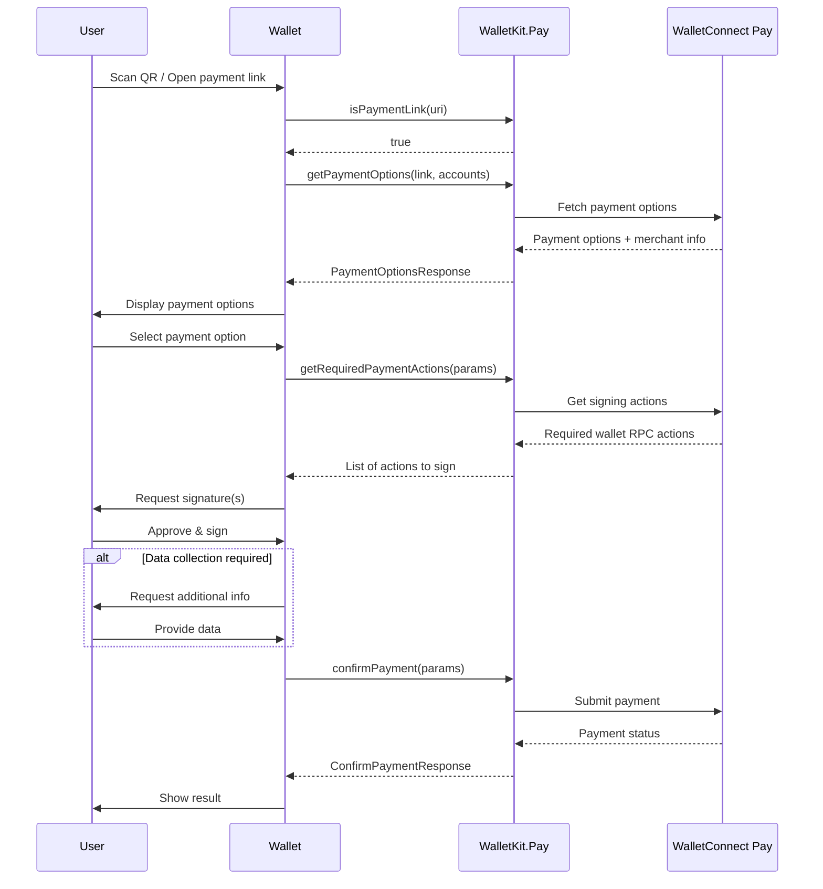

This documentation covers integrating WalletConnect Pay through WalletKit. This approach provides a unified API where Pay is automatically initialized alongside WalletKit, simplifying the integration for wallet developers.

<Tip>
**Using AI for Integration?** If you're using an AI IDE or assistant to help with integration, you can provide it with our comprehensive [AI integration prompt](/payments/wallets/walletkit/ai-prompts/kotlin.md) for better context and guidance.
</Tip>

## Requirements

- **Min SDK**: 23 (Android 6.0)
- **WalletKit**: 1.6.0+

## Installation

First, add the required repositories to your project's `settings.gradle.kts` or root `build.gradle.kts`:

```kotlin
allprojects {
    repositories {
        mavenCentral()
        maven { url = uri("https://jitpack.io") }
    }
}
```

Then add WalletKit to your app's `build.gradle.kts` using the BOM (Bill of Materials):

```kotlin
releaseImplementation(platform("com.reown:android-bom:$BOM_VERSION"))
releaseImplementation("com.reown:android-core")
releaseImplementation("com.reown:walletkit")
```

WalletConnectPay is automatically included as a dependency of WalletKit.

<Info>
Check the [GitHub releases](https://github.com/reown-com/reown-kotlin/releases) for the latest BOM version.
</Info>

## Initialization

WalletConnectPay is automatically initialized when you initialize WalletKit. No additional setup is required.

```kotlin
import com.reown.android.Core
import com.reown.android.CoreClient
import com.reown.walletkit.client.WalletKit
import com.reown.walletkit.client.Wallet

// First, initialize CoreClient in your Application class
val projectId = "" // Get Project ID at https://dashboard.walletconnect.com/
val appMetaData = Core.Model.AppMetaData(
    name = "Wallet Name",
    description = "Wallet Description",
    url = "Wallet URL",
    icons = listOf(/* list of icon url strings */),
    redirect = "kotlin-wallet-wc:/request" // Custom Redirect URI
)

CoreClient.initialize(
    projectId = projectId,
    application = this,
    metaData = appMetaData,
)

// Then initialize WalletKit
val initParams = Wallet.Params.Init(core = CoreClient)

WalletKit.initialize(initParams) { error ->
    // Error will be thrown if there's an issue during initialization
}
```

The Pay SDK is initialized internally with:
- `appId` from your WalletConnect Project ID
- `packageName` from your application context

<Info>
For more details on WalletKit initialization, see the [WalletKit Usage documentation](https://docs.walletconnect.network/wallet-sdk/android/usage#initialization).
</Info>

## Payment Link Detection

Use `WalletKit.Pay.isPaymentLink()` to determine if a scanned URI is a payment link or a standard WalletConnect pairing URI:

```kotlin
fun handleScannedUri(uri: String, accounts: List<String>) {
    if (WalletKit.Pay.isPaymentLink(uri)) {
        // Handle as payment - call getPaymentOptions
        WalletKit.Pay.getPaymentOptions(uri, accounts)
    } else {
        // Handle as WalletConnect pairing
        WalletKit.pair(Wallet.Params.Pair(uri))
    }
}
```

## Payment Flow

The payment flow consists of five main steps:

**Detect Payment Link -> Get Options -> Get Actions -> Sign Actions -> Confirm Payment**



<Steps>

<Step title="Get Payment Options" titleSize="h3">

Retrieve available payment options for a payment link:

```kotlin
import com.reown.walletkit.client.WalletKit
import com.reown.walletkit.client.Wallet

viewModelScope.launch {
    val result = WalletKit.Pay.getPaymentOptions(
        paymentLink = "https://pay.walletconnect.com/pay_xxx",
        accounts = listOf(
            "eip155:1:0xYourAddress",      // Ethereum
            "eip155:8453:0xYourAddress",   // Base
            "eip155:10:0xYourAddress",     // Optimism
            "eip155:137:0xYourAddress",    // Polygon
            "eip155:42161:0xYourAddress"   // Arbitrum
        )
    )

    result.onSuccess { response ->
        // Payment metadata
        val paymentId = response.paymentId
        val paymentInfo = response.info  // Merchant info, amount, expiry
        
        // Available payment options
        val options = response.options
        options.forEach { option ->
            println("Option: ${option.id}")
            println("Amount: ${option.amount.value} ${option.amount.unit}")
            println("Account: ${option.account}")
        }
        
        // Check if data collection is required
        val collectDataAction = response.collectDataAction
    }.onFailure { error ->
        handleError(error)
    }
}
```

</Step>

<Step title="Get Required Actions" titleSize="h3">

Get the wallet RPC actions needed to complete the payment:

```kotlin
val actionsResult = WalletKit.Pay.getRequiredPaymentActions(
    Wallet.Params.RequiredPaymentActions(
        paymentId = paymentId,
        optionId = selectedOption.id
    )
)

actionsResult.onSuccess { actions ->
    actions.forEach { action ->
        when (action) {
            is Wallet.Model.RequiredAction.WalletRpc -> {
                val rpcAction = action.action
                // rpcAction.chainId - e.g., "eip155:8453"
                // rpcAction.method - e.g., "eth_signTypedData_v4" or "personal_sign"
                // rpcAction.params - JSON string with signing parameters
            }
        }
    }
}.onFailure { error ->
    handleError(error)
}
```

</Step>

<Step title="Sign Actions" titleSize="h3">

Sign each required action using your wallet's signing implementation:

```kotlin
val signatures = actions.map { action ->
    when (action) {
        is Wallet.Model.RequiredAction.WalletRpc -> {
            val rpc = action.action
            when (rpc.method) {
                "eth_signTypedData_v4" -> signTypedDataV4(rpc.params)
                "personal_sign" -> personalSign(rpc.params)
                else -> throw UnsupportedOperationException("Unsupported: ${rpc.method}")
            }
        }
    }
}
```

#### Signing eth_signTypedData_v4

```kotlin
import org.json.JSONArray
import org.web3j.crypto.ECKeyPair
import org.web3j.crypto.Sign
import org.web3j.crypto.StructuredDataEncoder

fun signTypedDataV4(params: String): String {
    // params is a JSON array: [address, typedData]
    val paramsArray = JSONArray(params)
    val requestedAddress = paramsArray.getString(0)
    val typedData = paramsArray.getString(1)
    
    // Use StructuredDataEncoder for proper EIP-712 hashing
    val encoder = StructuredDataEncoder(typedData)
    val hash = encoder.hashStructuredData()
    
    val keyPair = ECKeyPair.create(privateKeyBytes)
    val signatureData = Sign.signMessage(hash, keyPair, false)
    
    val rHex = signatureData.r.bytesToHex()
    val sHex = signatureData.s.bytesToHex()
    val v = signatureData.v[0].toInt() and 0xff
    val vHex = v.toString(16).padStart(2, '0')
    
    return "0x$rHex$sHex$vHex".lowercase()
}
```

<Warning>
Signatures must be in the same order as the actions array.
</Warning>

</Step>

<Step title="Collect User Data (If Required)" titleSize="h3">

Some payments require additional user information:

```kotlin
response.collectDataAction?.let { collectAction ->
    val collectedData = collectAction.fields.map { field ->
        val value = when (field.fieldType) {
            Wallet.Model.CollectDataFieldType.TEXT -> getUserTextInput(field.name)
            Wallet.Model.CollectDataFieldType.DATE -> getUserDateInput(field.name) // YYYY-MM-DD
        }
        Wallet.Model.CollectDataFieldResult(
            id = field.id,
            value = value
        )
    }
}
```

</Step>

<Step title="Confirm Payment" titleSize="h3">

Submit signatures and finalize the payment:

```kotlin
val confirmResult = WalletKit.Pay.confirmPayment(
    Wallet.Params.ConfirmPayment(
        paymentId = paymentId,
        optionId = selectedOption.id,
        signatures = signatures,
        collectedData = collectedData // Optional
    )
)

confirmResult.onSuccess { response ->
    when (response.status) {
        Wallet.Model.PaymentStatus.SUCCEEDED -> {
            // Payment completed successfully
        }
        Wallet.Model.PaymentStatus.PROCESSING -> {
            // Payment is being processed
        }
        Wallet.Model.PaymentStatus.FAILED -> {
            // Payment failed
        }
        Wallet.Model.PaymentStatus.EXPIRED -> {
            // Payment expired
        }
        Wallet.Model.PaymentStatus.REQUIRES_ACTION -> {
            // Additional action required
        }
    }
}.onFailure { error ->
    handleError(error)
}
```

</Step>

</Steps>

## Complete Example

Here's a complete implementation example:

```kotlin
import com.reown.walletkit.client.WalletKit
import com.reown.walletkit.client.Wallet
import kotlinx.coroutines.launch

class PaymentViewModel : ViewModel() {

    fun handleScannedUri(uri: String) {
        if (WalletKit.Pay.isPaymentLink(uri)) {
            processPayment(uri)
        } else {
            // Handle as WalletConnect pairing
            WalletKit.pair(Wallet.Params.Pair(uri))
        }
    }

    fun processPayment(paymentLink: String) {
        viewModelScope.launch {
            val walletAddress = "0xYourAddress"
            
            // Step 1: Get payment options
            val optionsResult = WalletKit.Pay.getPaymentOptions(
                paymentLink = paymentLink,
                accounts = listOf(
                    "eip155:1:$walletAddress",
                    "eip155:8453:$walletAddress",
                    "eip155:10:$walletAddress"
                )
            )

            optionsResult.onSuccess { response ->
                val paymentId = response.paymentId
                val selectedOption = response.options.first()

                // Step 2: Get required actions
                val actionsResult = WalletKit.Pay.getRequiredPaymentActions(
                    Wallet.Params.RequiredPaymentActions(
                        paymentId = paymentId,
                        optionId = selectedOption.id
                    )
                )

                actionsResult.onSuccess { actions ->
                    // Step 3: Sign actions
                    val signatures = signActions(actions)

                    // Step 4: Collect data if required
                    val collectedData = response.collectDataAction?.let {
                        collectUserData(it.fields)
                    }

                    // Step 5: Confirm payment
                    val confirmResult = WalletKit.Pay.confirmPayment(
                        Wallet.Params.ConfirmPayment(
                            paymentId = paymentId,
                            optionId = selectedOption.id,
                            signatures = signatures,
                            collectedData = collectedData
                        )
                    )

                    confirmResult.onSuccess { confirmation ->
                        handlePaymentStatus(confirmation.status)
                    }.onFailure { error ->
                        handleError(error)
                    }
                }.onFailure { error ->
                    handleError(error)
                }
            }.onFailure { error ->
                handleError(error)
            }
        }
    }

    private suspend fun signActions(
        actions: List<Wallet.Model.RequiredAction>
    ): List<String> {
        return actions.map { action ->
            when (action) {
                is Wallet.Model.RequiredAction.WalletRpc -> {
                    signWithWallet(action.action)
                }
            }
        }
    }

    private fun handlePaymentStatus(status: Wallet.Model.PaymentStatus) {
        when (status) {
            Wallet.Model.PaymentStatus.SUCCEEDED -> showSuccess()
            Wallet.Model.PaymentStatus.PROCESSING -> showProcessing()
            Wallet.Model.PaymentStatus.FAILED -> showFailure()
            Wallet.Model.PaymentStatus.EXPIRED -> showExpired()
            Wallet.Model.PaymentStatus.REQUIRES_ACTION -> { /* Handle */ }
        }
    }
}
```

## API Reference

### WalletKit.Pay

The payment operations object within WalletKit.

#### Methods

| Method | Description |
|--------|-------------|
| `isPaymentLink(uri: String): Boolean` | Check if URI is a payment link |
| `getPaymentOptions(paymentLink, accounts)` | Get available payment options |
| `getRequiredPaymentActions(params)` | Get actions requiring signatures |
| `confirmPayment(params)` | Confirm and finalize payment |

### Parameters

#### Wallet.Params.RequiredPaymentActions

```kotlin
data class RequiredPaymentActions(
    val paymentId: String,
    val optionId: String
)
```

#### Wallet.Params.ConfirmPayment

```kotlin
data class ConfirmPayment(
    val paymentId: String,
    val optionId: String,
    val signatures: List<String>,
    val collectedData: List<Wallet.Model.CollectDataFieldResult>? = null
)
```

## Data Models

### Wallet.Model.PaymentOptionsResponse

```kotlin
data class PaymentOptionsResponse(
    val paymentId: String,
    val info: PaymentInfo?,
    val options: List<PaymentOption>,
    val collectDataAction: CollectDataAction?
)
```

### Wallet.Model.PaymentInfo

```kotlin
data class PaymentInfo(
    val status: PaymentStatus,
    val amount: PaymentAmount,
    val expiresAt: Long,
    val merchant: MerchantInfo
)

data class MerchantInfo(
    val name: String,
    val iconUrl: String?
)
```

### Wallet.Model.PaymentOption

```kotlin
data class PaymentOption(
    val id: String,
    val amount: PaymentAmount,
    val account: String,
    val estimatedTxs: Int?
)
```

### Wallet.Model.PaymentAmount

```kotlin
data class PaymentAmount(
    val value: String,
    val unit: String,
    val display: PaymentAmountDisplay?
)

data class PaymentAmountDisplay(
    val assetSymbol: String,
    val assetName: String,
    val decimals: Int,
    val iconUrl: String?,
    val networkName: String?,
    val networkIconUrl: String?
)
```

### Wallet.Model.WalletRpcAction

```kotlin
data class WalletRpcAction(
    val chainId: String,   // CAIP-2 chain ID (e.g., "eip155:8453")
    val method: String,    // RPC method
    val params: String     // JSON-encoded parameters
)
```

### Wallet.Model.PaymentStatus

| Status | Description |
|--------|-------------|
| `REQUIRES_ACTION` | Additional action needed |
| `PROCESSING` | Payment in progress |
| `SUCCEEDED` | Payment completed |
| `FAILED` | Payment failed |
| `EXPIRED` | Payment expired |

## Best Practices

1. **Use WalletKit Integration**: If your wallet already uses WalletKit, prefer this approach for automatic configuration

2. **Use `isPaymentLink()` for Detection**: Use the utility method instead of manual URL parsing for reliable payment link detection

3. **Account Format**: Always use CAIP-10 format for accounts: `eip155:{chainId}:{address}`

4. **Multiple Chains**: Provide accounts for all supported chains to maximize payment options

5. **Signature Order**: Maintain the same order of signatures as the actions array

6. **Error Handling**: Always handle errors gracefully and show appropriate user feedback

7. **Loading States**: Show loading indicators during API calls and signing operations

8. **Expiration**: Check `paymentInfo.expiresAt` and warn users if time is running low

9. **User Data**: Only collect data when `collectData` is present in the response and you don't already have the required user data. If you already have the required data, you can submit this without collecting from the user. You must make sure the user accepts WalletConnect Terms and Conditions and Privacy Policy before submitting user information to WalletConnect.
