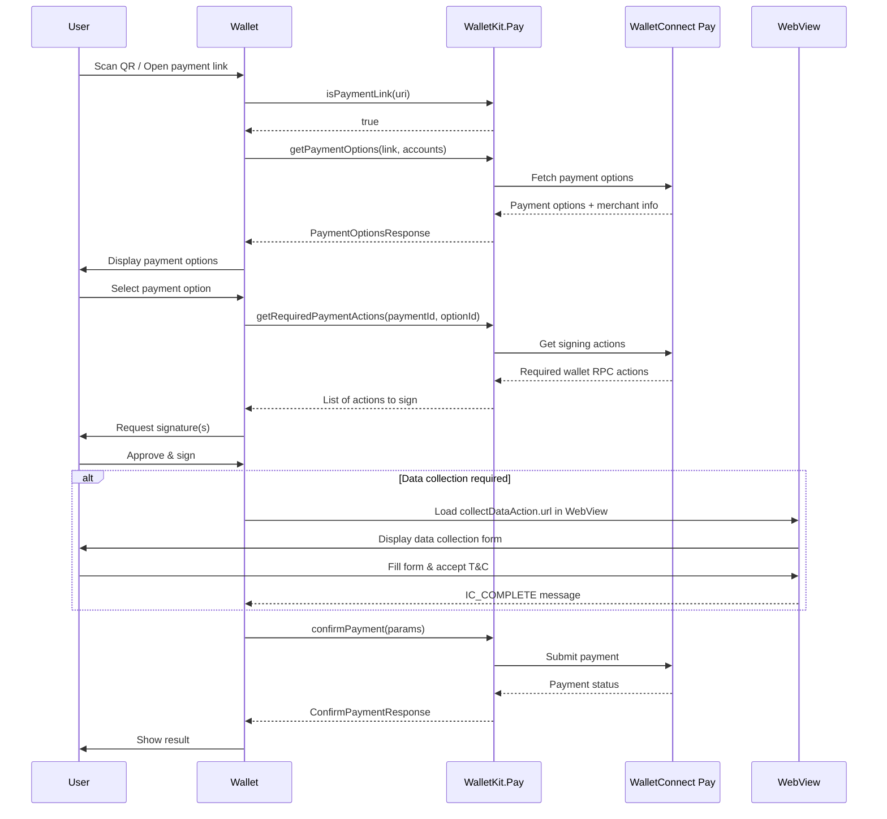

import AppIdSnippet from "/snippets/app-id.mdx";
import WebViewOverview from "/snippets/webview-data-collection-overview.mdx";
import WebViewBestPractices from "/snippets/webview-data-collection-best-practices.mdx";
import WebViewMessageTypes from "/snippets/webview-message-types.mdx";

This documentation covers integrating WalletConnect Pay through WalletKit. This approach provides a unified API where Pay is automatically configured when you configure WalletKit, simplifying the integration for wallet developers.

<Tip>
**Using AI for Integration?** If you're using an AI IDE or assistant to help with integration, you can provide it with our comprehensive [AI integration prompt](/payments/wallets/walletkit/ai-prompts/swift) for better context and guidance.
</Tip>

## Requirements

- iOS 13.0+
- Swift 5.7+
- Xcode 14.0+
- WalletKit (ReownWalletKit)

<AppIdSnippet />

## Installation

### Swift Package Manager

Add ReownWalletKit to your `Package.swift`:

```swift
dependencies: [
    .package(url: "https://github.com/reown-com/reown-swift", from: "1.0.0")
]
```

Then add `ReownWalletKit` to your target dependencies:

```swift
.target(
    name: "YourApp",
    dependencies: ["ReownWalletKit"]
)
```

WalletConnectPay is automatically included as a dependency of WalletKit.

<Info>
Check the [GitHub releases](https://github.com/reown-com/reown-swift/releases) for the latest version.
</Info>

## Configuration

When using WalletKit, Pay is automatically configured using your project's `Networking.projectId`. No separate configuration is needed.

```swift
import ReownWalletKit

func application(_ application: UIApplication, didFinishLaunchingWithOptions...) {
    // Configure WalletKit - Pay is automatically configured
    WalletKit.configure(
        metadata: AppMetadata(
            name: "My Wallet",
            description: "A crypto wallet",
            url: "https://mywallet.com",
            icons: ["https://mywallet.com/icon.png"]
        ),
        crypto: DefaultCryptoProvider(),
        payLogging: true  // Enable Pay debug logging
    )
}
```

## Payment Link Detection

Use the static `isPaymentLink` method to detect payment links before processing:

```swift
// Static method - can be called before configure()
if WalletKit.isPaymentLink(scannedString) {
    startPaymentFlow(paymentLink: scannedString)
}

// Or via the instance
if WalletKit.instance.Pay.isPaymentLink(scannedString) {
    startPaymentFlow(paymentLink: scannedString)
}
```

The `isPaymentLink` utility method detects WalletConnect Pay links by checking for:
- `pay.` hosts (e.g., pay.walletconnect.com)
- `pay=` parameter in WalletConnect URIs
- `pay_` prefix in bare payment IDs

## Payment Flow

The payment flow consists of five main steps:

**Detect Payment Link -> Get Options -> Get Actions -> Sign Actions -> Confirm Payment**



<Steps>

<Step title="Get Payment Options" titleSize="h3">

When a user scans a payment QR code or opens a payment link, fetch available payment options:

```swift
// 1. Get payment options
let options = try await WalletKit.instance.Pay.getPaymentOptions(
    paymentLink: paymentLink,
    accounts: ["eip155:1:\(address)", "eip155:137:\(address)"]
)

// Display merchant info
if let info = options.info {
    print("Merchant: \(info.merchant.name)")
    print("Amount: \(info.amount.display.assetSymbol) \(info.amount.value)")
}

// Show available payment options to user
for option in options.options {
    print("Pay with \(option.amount.display.assetSymbol) on \(option.amount.display.networkName ?? "Unknown")")
}

// Check if user data collection is required
if let collectData = options.collectData {
    for field in collectData.fields {
        print("Required field: \(field.name) (type: \(field.fieldType))")
    }
}
```

</Step>

<Step title="Get Required Actions" titleSize="h3">

After the user selects a payment option, get the signing actions:

```swift
// 2. Get required actions for selected option
let actions = try await WalletKit.instance.Pay.getRequiredPaymentActions(
    paymentId: options.paymentId,
    optionId: selectedOption.id
)
```

</Step>

<Step title="Sign Actions" titleSize="h3">

Each action contains a `walletRpc` with EIP-712 typed data that needs to be signed:

```swift
// 3. Sign each action and collect signatures
var signatures: [String] = []
for action in actions {
    let signature = try await sign(action.walletRpc)
    signatures.append(signature)
}
```

#### Signing Implementation

```swift
private func signTypedData(
    action: Action,
    walletAddress: String,
    signer: YourSignerProtocol
) async throws -> String {
    let rpc = action.walletRpc
    
    // Parse params: ["address", "typedDataJson"]
    guard let paramsData = rpc.params.data(using: .utf8),
          let params = try JSONSerialization.jsonObject(with: paramsData) as? [Any],
          params.count >= 2,
          let typedDataJson = params[1] as? String else {
        throw PaymentError.invalidParams
    }
    
    return try await signer.signTypedData(
        data: typedDataJson,
        address: walletAddress
    )
}
```

<Warning>
Signatures must be in the same order as the actions array.
</Warning>

</Step>

<Step title="Collect User Data (If Required)" titleSize="h3">

If `options.collectData` is not nil, you must collect user information before confirming:

<WebViewOverview />

```swift
if let collectData = options.collectData, let url = collectData.url {
    let prefillData: [String: String] = [
        "fullName": "John Doe",
        "dateOfBirth": "1990-01-15"
    ]
    let jsonData = try JSONSerialization.data(withJSONObject: prefillData)
    let prefillBase64 = jsonData.base64EncodedString()
    let webViewUrl = "\(url)?prefill=\(prefillBase64)"

    // Show WebView and wait for IC_COMPLETE message
    showWebView(url: webViewUrl)
}
```

<WebViewMessageTypes />

</Step>

<Step title="Confirm Payment" titleSize="h3">

Submit the signatures and collected data to complete the payment:

```swift
// 4. Confirm payment
let result = try await WalletKit.instance.Pay.confirmPayment(
    paymentId: options.paymentId,
    optionId: selectedOption.id,
    signatures: signatures,
    collectedData: collectedData
)

switch result.status {
case .succeeded:
    print("Payment successful!")
case .processing:
    print("Payment is being processed...")
case .failed:
    print("Payment failed")
case .expired:
    print("Payment expired")
case .requiresAction:
    print("Additional action required")
}
```

</Step>

</Steps>

## WebView Implementation

When `collectData.url` is present, display the URL in a `WKWebView`. The WebView handles form rendering, validation, and T&C acceptance.

```swift
import WebKit
import SwiftUI

struct PayDataCollectionWebView: UIViewRepresentable {
    let url: URL
    let onComplete: () -> Void
    let onError: (String) -> Void

    func makeCoordinator() -> Coordinator {
        Coordinator(onComplete: onComplete, onError: onError)
    }

    func makeUIView(context: Context) -> WKWebView {
        let config = WKWebViewConfiguration()
        config.userContentController.add(
            context.coordinator,
            name: "payDataCollectionComplete"
        )

        let webView = WKWebView(frame: .zero, configuration: config)
        webView.navigationDelegate = context.coordinator
        webView.load(URLRequest(url: url))
        return webView
    }

    func updateUIView(_ uiView: WKWebView, context: Context) {}

    class Coordinator: NSObject, WKScriptMessageHandler, WKNavigationDelegate {
        let onComplete: () -> Void
        let onError: (String) -> Void

        init(onComplete: @escaping () -> Void, onError: @escaping (String) -> Void) {
            self.onComplete = onComplete
            self.onError = onError
        }

        func userContentController(
            _ userContentController: WKUserContentController,
            didReceive message: WKScriptMessage
        ) {
            guard let body = message.body as? String,
                  let data = body.data(using: .utf8),
                  let json = try? JSONSerialization.jsonObject(with: data) as? [String: Any],
                  let type = json["type"] as? String else { return }

            DispatchQueue.main.async {
                switch type {
                case "IC_COMPLETE":
                    self.onComplete()
                case "IC_ERROR":
                    let error = json["error"] as? String ?? "Unknown error"
                    self.onError(error)
                default:
                    break
                }
            }
        }

        func webView(
            _ webView: WKWebView,
            decidePolicyFor navigationAction: WKNavigationAction,
            decisionHandler: @escaping (WKNavigationActionPolicy) -> Void
        ) {
            guard let url = navigationAction.request.url else {
                decisionHandler(.allow)
                return
            }
            if let host = url.host, !host.contains("pay.walletconnect.com") {
                UIApplication.shared.open(url)
                decisionHandler(.cancel)
                return
            }
            decisionHandler(.allow)
        }
    }
}
```

## Complete Example

Here's a complete implementation using WalletKit:

```swift
import ReownWalletKit

class PaymentManager {
    
    func processPayment(
        paymentLink: String,
        walletAddress: String,
        signer: YourSignerProtocol
    ) async throws {
        
        // 1. Get payment options
        let accounts = [
            "eip155:1:\(walletAddress)",
            "eip155:137:\(walletAddress)",
            "eip155:8453:\(walletAddress)"
        ]
        
        let optionsResponse = try await WalletKit.instance.Pay.getPaymentOptions(
            paymentLink: paymentLink,
            accounts: accounts
        )
        
        guard !optionsResponse.options.isEmpty else {
            throw PaymentError.noOptionsAvailable
        }
        
        // 2. Let user select an option (simplified - use first option)
        let selectedOption = optionsResponse.options[0]
        
        // 3. Get required actions
        let actions = try await WalletKit.instance.Pay.getRequiredPaymentActions(
            paymentId: optionsResponse.paymentId,
            optionId: selectedOption.id
        )
        
        // 4. Sign all actions
        var signatures: [String] = []
        for action in actions {
            let signature = try await signTypedData(
                action: action,
                walletAddress: walletAddress,
                signer: signer
            )
            signatures.append(signature)
        }
        
        // 5. Collect data via WebView if required
        if let collectData = optionsResponse.collectData, let url = collectData.url {
            try await showDataCollectionWebView(url: url)
        }

        // 6. Confirm payment (no collectedData when WebView is used)
        let result = try await WalletKit.instance.Pay.confirmPayment(
            paymentId: optionsResponse.paymentId,
            optionId: selectedOption.id,
            signatures: signatures
        )
        
        guard result.status == .succeeded else {
            throw PaymentError.paymentFailed(result.status)
        }
    }
    
    private func signTypedData(
        action: Action,
        walletAddress: String,
        signer: YourSignerProtocol
    ) async throws -> String {
        let rpc = action.walletRpc
        
        // Parse params: ["address", "typedDataJson"]
        guard let paramsData = rpc.params.data(using: .utf8),
              let params = try JSONSerialization.jsonObject(with: paramsData) as? [Any],
              params.count >= 2,
              let typedDataJson = params[1] as? String else {
            throw PaymentError.invalidParams
        }
        
        return try await signer.signTypedData(
            data: typedDataJson,
            address: walletAddress
        )
    }
}
```

## Deep Link Handling

To handle payment links opened from outside your app:

```swift
// In SceneDelegate or AppDelegate
func scene(_ scene: UIScene, openURLContexts URLContexts: Set<UIOpenURLContext>) {
    guard let url = URLContexts.first?.url else { return }
    
    // Use isPaymentLink for reliable detection
    if WalletKit.isPaymentLink(url.absoluteString) {
        startPaymentFlow(paymentLink: url.absoluteString)
    }
}
```

## QR Code Scanning

Payment links can be encoded as QR codes. Use the `isPaymentLink` utility for detection:

```swift
func handleScannedQR(_ content: String) {
    if WalletKit.isPaymentLink(content) {
        // WalletConnect Pay QR code
        startPaymentFlow(paymentLink: content)
    }
}
```

## API Reference

### WalletKit Integration

When using WalletKit, Pay methods are accessed via `WalletKit.instance.Pay.*`.

#### Static Methods

| Method | Description |
|--------|-------------|
| `WalletKit.isPaymentLink(_:)` | Check if a string is a payment link (can call before `configure()`) |

#### Instance Methods (WalletKit.instance.Pay)

| Method | Description |
|--------|-------------|
| `isPaymentLink(_:)` | Check if a string is a payment link |
| `getPaymentOptions(paymentLink:accounts:includePaymentInfo:)` | Fetch available payment options |
| `getRequiredPaymentActions(paymentId:optionId:)` | Get signing actions for a payment option |
| `confirmPayment(paymentId:optionId:signatures:maxPollMs:)` | Confirm and execute the payment |

### Data Types

#### PaymentOptionsResponse

```swift
struct PaymentOptionsResponse {
    let paymentId: String              // Unique payment identifier
    let info: PaymentInfo?             // Merchant and amount details
    let options: [PaymentOption]       // Available payment methods
    let collectData: CollectDataAction? // Required user data fields (travel rule)
}
```

#### PaymentInfo

```swift
struct PaymentInfo {
    let status: PaymentStatus          // Current payment status
    let amount: PayAmount              // Requested payment amount
    let expiresAt: Int64               // Expiration timestamp
    let merchant: MerchantInfo         // Merchant details
    let buyer: BuyerInfo?              // Buyer info if available
}
```

#### PaymentOption

```swift
struct PaymentOption {
    let id: String                     // Option identifier
    let amount: PayAmount              // Amount in this asset
    let etaS: Int64                    // Estimated time to complete (seconds)
    let actions: [Action]              // Required signing actions
}
```

#### PayAmount

```swift
struct PayAmount {
    let unit: String                   // Asset unit (e.g., "USDC")
    let value: String                  // Raw value in smallest unit
    let display: AmountDisplay         // Human-readable display info
}

struct AmountDisplay {
    let assetSymbol: String            // Token symbol (e.g., "USDC")
    let assetName: String              // Token name (e.g., "USD Coin")
    let decimals: Int64                // Token decimals
    let iconUrl: String?               // Token icon URL
    let networkName: String?           // Network name (e.g., "Base")
}
```

#### Action & WalletRpcAction

```swift
struct Action {
    let walletRpc: WalletRpcAction     // RPC call to sign
}

struct WalletRpcAction {
    let chainId: String                // Chain ID (e.g., "eip155:8453")
    let method: String                 // RPC method (eth_signTypedData_v4)
    let params: String                 // JSON-encoded parameters
}
```

#### CollectDataAction

```swift
struct CollectDataAction {
    let url: String                    // WebView URL for data collection
    let schema: String?                // JSON schema describing required fields
}
```

#### ConfirmPaymentResultResponse

```swift
struct ConfirmPaymentResultResponse {
    let status: PaymentStatus          // Final payment status
    let isFinal: Bool                  // Whether status is final
    let pollInMs: Int64?               // Suggested poll interval
    let info: PaymentResultInfo?       // Transaction result details
}

struct PaymentResultInfo {
    let txId: String                   // Transaction ID
    let optionAmount: PayAmount        // Token amount details
}
```

#### PaymentStatus

```swift
enum PaymentStatus {
    case requiresAction                // Additional action needed
    case processing                    // Payment in progress
    case succeeded                     // Payment completed
    case failed                        // Payment failed
    case expired                       // Payment expired
}
```

## Error Handling

The SDK throws specific error types for different failure scenarios:

### GetPaymentOptionsError

| Error | Description |
|-------|-------------|
| `.paymentNotFound` | Payment ID doesn't exist |
| `.paymentExpired` | Payment has expired |
| `.invalidRequest` | Invalid request parameters |
| `.invalidAccount` | Invalid account format |
| `.complianceFailed` | Compliance check failed |
| `.http` | Network error |
| `.internalError` | Server error |

### GetPaymentRequestError

| Error | Description |
|-------|-------------|
| `.optionNotFound` | Selected option doesn't exist |
| `.paymentNotFound` | Payment ID doesn't exist |
| `.invalidAccount` | Invalid account format |
| `.http` | Network error |

### ConfirmPaymentError

| Error | Description |
|-------|-------------|
| `.paymentNotFound` | Payment ID doesn't exist |
| `.paymentExpired` | Payment has expired |
| `.invalidOption` | Invalid option ID |
| `.invalidSignature` | Signature verification failed |
| `.routeExpired` | Payment route expired |
| `.http` | Network error |

## Best Practices

1. **Use WalletKit Integration**: If your wallet already uses WalletKit, prefer the `WalletKit.instance.Pay.*` access pattern for automatic configuration

2. **Use `isPaymentLink()` for Detection**: Use the utility method instead of manual URL parsing for reliable payment link detection

3. **Account Format**: Always use CAIP-10 format for accounts: `eip155:{chainId}:{address}`

4. **Multiple Chains**: Provide accounts for all supported chains to maximize payment options

5. **Signature Order**: Maintain the same order of signatures as the actions array

6. **Error Handling**: Always handle errors gracefully and show appropriate user feedback

7. **Loading States**: Show loading indicators during API calls and signing operations

8. **Expiration**: Check `paymentInfo.expiresAt` and warn users if time is running low

9. **User Data**: Only collect data when `collectData` is present in the response and you don't already have the required user data. If you already have the required data, you can submit this without collecting from the user. You must make sure the user accepts WalletConnect Terms and Conditions and Privacy Policy before submitting user information to WalletConnect.

10. **WebView Data Collection**: When `collectData.url` is present, display the URL in a WKWebView rather than building native forms. The WebView handles form rendering, validation, and T&C acceptance.
