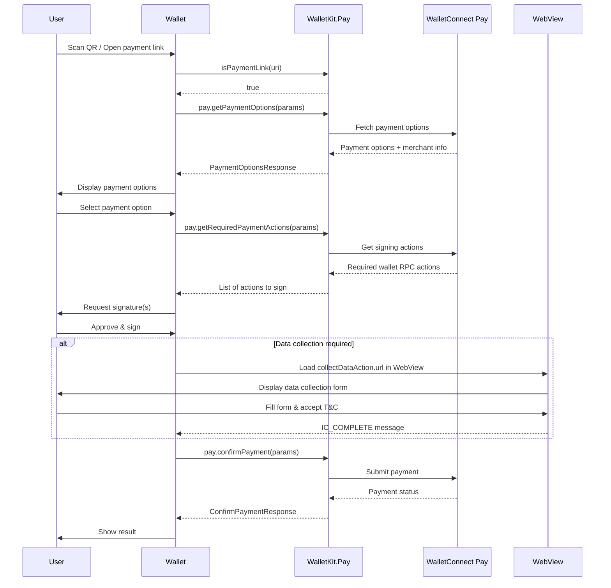

import AppIdSnippet from "/snippets/app-id.mdx";
import WebViewOverview from "/snippets/webview-data-collection-overview.mdx";
import WebViewBestPractices from "/snippets/webview-data-collection-best-practices.mdx";
import WebViewMessageTypes from "/snippets/webview-message-types.mdx";

<Warning>
WalletConnect Pay is currently only available on React Native and requires `@walletconnect/react-native-compat` to be installed. Web/Node.js versions will be available soon.
</Warning>

This documentation covers integrating WalletConnect Pay through WalletKit for React Native wallets. This approach provides a unified API where Pay is built into WalletKit, simplifying the integration for wallet developers.

<Tip>
**Using AI for Integration?** If you're using an AI IDE or assistant to help with integration, you can provide it with our comprehensive [AI integration prompt](/payments/wallets/walletkit/ai-prompts/react-native) for better context and guidance.
</Tip>

## Requirements

- Node.js 16+
- WalletKit (`@reown/walletkit`)

<AppIdSnippet />

## Installation

Install WalletKit using npm or yarn:

<Tabs>
<Tab title="npm">
```bash
npm install @reown/walletkit @walletconnect/core
```
</Tab>
<Tab title="yarn">
```bash
yarn add @reown/walletkit @walletconnect/core
```
</Tab>
</Tabs>

WalletConnect Pay is automatically included as part of WalletKit.

<Info>
Check the [npm page](https://www.npmjs.com/package/@reown/walletkit) for the latest version.
</Info>

## Initialization

Initialize WalletKit as usual. Pay functionality is automatically available:

```javascript
import { Core } from "@walletconnect/core";
import { WalletKit } from "@reown/walletkit";

const core = new Core({
  projectId: process.env.PROJECT_ID,
});

const walletkit = await WalletKit.init({
  core, // <- pass the shared `core` instance
  metadata: {
    name: "Demo app",
    description: "Demo Client as Wallet/Peer",
    url: "www.walletconnect.com",
    icons: [],
  },
});
```

## Payment Link Detection

Use `isPaymentLink` to determine if a scanned URI is a payment link or a standard WalletConnect pairing URI:

```javascript
import { isPaymentLink } from "@reown/walletkit";

// Use when handling a scanned QR code or deep link
if (isPaymentLink(uri)) {
  // Handle as payment (see below)
  await processPayment(uri);
} else {
  // Handle as WalletConnect pairing
  await walletkit.pair({ uri });
}
```

## Payment Flow

The payment flow consists of five main steps:

**Detect Payment Link -> Get Options -> Get Actions -> Sign Actions -> Confirm Payment**



<Steps>

<Step title="Get Payment Options" titleSize="h3">

Retrieve available payment options for a payment link:

```javascript
const options = await walletkit.pay.getPaymentOptions({
  paymentLink: "https://pay.walletconnect.com/...",
  accounts: ["eip155:1:0x...", "eip155:8453:0x..."],
  includePaymentInfo: true,
});

// options.paymentId - unique payment identifier
// options.options - array of payment options (different tokens/chains)
// options.info - payment details (amount, merchant, expiry)

// Display merchant info
if (options.info) {
  console.log("Merchant:", options.info.merchant.name);
  console.log("Amount:", options.info.amount.display.assetSymbol, options.info.amount.value);
}

// Check if data collection is required
if (options.collectData) {
  console.log("Required fields:", options.collectData.fields);
}
```

</Step>

<Step title="Get Required Actions" titleSize="h3">

Get the wallet RPC actions needed to complete the payment:

```javascript
const actions = await walletkit.pay.getRequiredPaymentActions({
  paymentId: options.paymentId,
  optionId: options.options[0].id,
});

// actions - array of wallet RPC calls to sign
// Each action contains: { walletRpc: { chainId, method, params } }

for (const action of actions) {
  console.log("Chain:", action.walletRpc.chainId);
  console.log("Method:", action.walletRpc.method);
  console.log("Params:", action.walletRpc.params);
}
```

</Step>

<Step title="Sign Actions" titleSize="h3">

Sign each required action using your wallet's signing implementation:

```javascript
// Sign the required actions and collect signatures
const signatures = await Promise.all(
  actions.map(async (action) => {
    const { chainId, method, params } = action.walletRpc;
    
    // Parse params - typically ["address", "typedDataJson"]
    const parsedParams = JSON.parse(params);
    
    // Use your wallet's signing implementation
    return await wallet.signTypedData(chainId, parsedParams);
  })
);
```

<Warning>
Signatures must be in the same order as the actions array.
</Warning>

</Step>

<Step title="Collect User Data (If Required)" titleSize="h3">

Some payments may require additional user data:

<WebViewOverview />

```javascript
if (options.collectData?.url) {
  const prefillData = {
    fullName: "John Doe",
    dateOfBirth: "1990-01-15",
  };
  const prefillBase64 = btoa(JSON.stringify(prefillData));
  const webViewUrl = `${options.collectData.url}?prefill=${prefillBase64}`;

  // Show WebView and wait for IC_COMPLETE message
  showDataCollectionWebView(webViewUrl);
}
```

<WebViewMessageTypes />

</Step>

<Step title="Confirm Payment" titleSize="h3">

Submit the signatures and collected data to complete the payment:

```javascript
const result = await walletkit.pay.confirmPayment({
  paymentId: options.paymentId,
  optionId: options.options[0].id,
  signatures,
  collectedData, // Optional, if collectData was present
});

// result.status - "succeeded" | "processing" | "failed" | "expired"
// result.isFinal - whether the payment is complete
// result.pollInMs - if not final, poll again after this delay

if (result.status === "succeeded") {
  console.log("Payment successful!");
} else if (result.status === "processing") {
  console.log("Payment is processing...");
} else if (result.status === "failed") {
  console.log("Payment failed");
}
```

</Step>

</Steps>

## WebView Implementation

When `collectData.url` is present, display the URL in a WebView using `react-native-webview`. Install the dependency:

```bash
npm install react-native-webview@13.16.0
```

```jsx
import React, { useCallback } from "react";
import { WebView } from "react-native-webview";
import { Linking, View, ActivityIndicator } from "react-native";

function PayDataCollectionWebView({ url, onComplete, onError }) {
  const handleMessage = useCallback(
    (event) => {
      try {
        const data = JSON.parse(event.nativeEvent.data);
        switch (data.type) {
          case "IC_COMPLETE":
            onComplete();
            break;
          case "IC_ERROR":
            onError(data.error || "Unknown error");
            break;
        }
      } catch {
        // Ignore non-JSON messages
      }
    },
    [onComplete, onError]
  );

  const handleNavigationRequest = useCallback((request) => {
    if (!request.url.includes("pay.walletconnect.com")) {
      Linking.openURL(request.url);
      return false;
    }
    return true;
  }, []);

  return (
    <WebView
      source={{ uri: url }}
      onMessage={handleMessage}
      onShouldStartLoadWithRequest={handleNavigationRequest}
      javaScriptEnabled
      domStorageEnabled
      startInLoadingState
      renderLoading={() => (
        <View style={{ flex: 1, justifyContent: "center", alignItems: "center" }}>
          <ActivityIndicator size="large" />
        </View>
      )}
    />
  );
}

function buildPrefillUrl(baseUrl, prefillData) {
  if (Object.keys(prefillData).length === 0) return baseUrl;
  const base64 = btoa(JSON.stringify(prefillData));
  return `${baseUrl}?prefill=${base64}`;
}
```

## Complete Example

Here's a complete implementation example:

```javascript
import { Core } from "@walletconnect/core";
import { WalletKit, isPaymentLink } from "@reown/walletkit";

class PaymentManager {
  constructor() {
    this.walletkit = null;
  }

  async initialize(projectId) {
    const core = new Core({ projectId });
    
    this.walletkit = await WalletKit.init({
      core,
      metadata: {
        name: "My Wallet",
        description: "A crypto wallet",
        url: "https://mywallet.com",
        icons: ["https://mywallet.com/icon.png"],
      },
    });
  }

  async handleScannedUri(uri) {
    if (isPaymentLink(uri)) {
      await this.processPayment(uri);
    } else {
      await this.walletkit.pair({ uri });
    }
  }

  async processPayment(paymentLink) {
    const walletAddress = "0xYourAddress";
    
    try {
      // Step 1: Get payment options
      const options = await this.walletkit.pay.getPaymentOptions({
        paymentLink,
        accounts: [
          `eip155:1:${walletAddress}`,
          `eip155:8453:${walletAddress}`,
          `eip155:137:${walletAddress}`,
        ],
        includePaymentInfo: true,
      });

      if (options.options.length === 0) {
        throw new Error("No payment options available");
      }

      // Step 2: Let user select an option (simplified - use first option)
      const selectedOption = options.options[0];

      // Step 3: Get required actions
      const actions = await this.walletkit.pay.getRequiredPaymentActions({
        paymentId: options.paymentId,
        optionId: selectedOption.id,
      });

      // Step 4: Sign all actions
      const signatures = await Promise.all(
        actions.map((action) => this.signAction(action, walletAddress))
      );

      // Step 5: Collect data via WebView if required
      if (options.collectData?.url) {
        await this.showDataCollectionWebView(options.collectData.url);
      }

      // Step 6: Confirm payment (no collectedData when WebView is used)
      const result = await this.walletkit.pay.confirmPayment({
        paymentId: options.paymentId,
        optionId: selectedOption.id,
        signatures,
      });

      return result;
    } catch (error) {
      console.error("Payment failed:", error);
      throw error;
    }
  }

  async signAction(action, walletAddress) {
    const { chainId, method, params } = action.walletRpc;
    const parsedParams = JSON.parse(params);

    // Use your wallet's signing implementation
    return await wallet.signTypedData(chainId, parsedParams);
  }
}
```

## API Reference

### WalletKit Pay Methods

Pay methods are accessed via `walletkit.pay.*`.

#### Utility Functions

| Function | Description |
|----------|-------------|
| `isPaymentLink(uri: string): boolean` | Check if URI is a payment link (imported from `@reown/walletkit`) |

#### Instance Methods (walletkit.pay)

| Method | Description |
|--------|-------------|
| `getPaymentOptions(params)` | Fetch available payment options |
| `getRequiredPaymentActions(params)` | Get signing actions for a payment option |
| `confirmPayment(params)` | Confirm and execute the payment |

### Parameters

#### GetPaymentOptionsParams

```typescript
interface GetPaymentOptionsParams {
  paymentLink: string;      // Payment link URL
  accounts: string[];       // CAIP-10 accounts
  includePaymentInfo?: boolean;  // Include payment info in response
}
```

#### GetRequiredPaymentActionsParams

```typescript
interface GetRequiredPaymentActionsParams {
  paymentId: string;        // Payment ID from getPaymentOptions
  optionId: string;         // Selected option ID
}
```

#### ConfirmPaymentParams

```typescript
interface ConfirmPaymentParams {
  paymentId: string;        // Payment ID
  optionId: string;         // Selected option ID
  signatures: string[];     // Signatures from wallet RPC calls
}
```

### Response Types

#### PaymentOptionsResponse

```typescript
interface PaymentOptionsResponse {
  paymentId: string;        // Unique payment identifier
  info?: PaymentInfo;       // Payment information
  options: PaymentOption[]; // Available payment options
  collectData?: CollectDataAction;  // Data collection requirements
}
```

#### PaymentOption

```typescript
interface PaymentOption {
  id: string;               // Option identifier
  amount: PayAmount;        // Amount in this asset
  etaS: number;             // Estimated time to complete (seconds)
  actions: Action[];        // Required signing actions
}
```

#### Action

```typescript
interface Action {
  walletRpc: WalletRpcAction;
}

interface WalletRpcAction {
  chainId: string;          // CAIP-2 chain ID (e.g., "eip155:8453")
  method: string;           // RPC method (e.g., "eth_signTypedData_v4")
  params: string;           // JSON-encoded parameters
}
```

#### ConfirmPaymentResponse

```typescript
interface ConfirmPaymentResponse {
  status: PaymentStatus;    // Payment status
  isFinal: boolean;         // Whether status is final
  pollInMs?: number;        // Suggested poll interval
  info?: PaymentResultInfo; // Transaction result details
}

interface PaymentResultInfo {
  txId: string;             // Transaction ID
  optionAmount: PayAmount;  // Token amount details
}

type PaymentStatus =
  | "requires_action"
  | "processing"
  | "succeeded"
  | "failed"
  | "expired";
```

#### PaymentInfo

```typescript
interface PaymentInfo {
  status: PaymentStatus;    // Current payment status
  amount: PayAmount;        // Requested payment amount
  expiresAt: number;        // Expiration timestamp (seconds since epoch)
  merchant: MerchantInfo;   // Merchant details
  buyer?: BuyerInfo;        // Buyer info if available
}

interface MerchantInfo {
  name: string;             // Merchant display name
  iconUrl?: string;         // Merchant logo URL
}
```

#### PayAmount

```typescript
interface PayAmount {
  unit: string;             // Asset unit
  value: string;            // Raw value in smallest unit
  display: AmountDisplay;   // Human-readable display info
}

interface AmountDisplay {
  assetSymbol: string;      // Token symbol (e.g., "USDC")
  assetName: string;        // Token name (e.g., "USD Coin")
  decimals: number;         // Token decimals
  iconUrl?: string;         // Token icon URL
  networkName?: string;     // Network name (e.g., "Base")
}
```

#### CollectDataAction

```typescript
interface CollectDataAction {
  /** WebView URL for data collection */
  url: string;
  /** JSON schema describing required fields */
  schema?: string;
}
```

## Error Handling

Handle errors gracefully in your payment flow:

```javascript
try {
  const options = await walletkit.pay.getPaymentOptions({
    paymentLink,
    accounts,
  });
} catch (error) {
  if (error.message.includes("payment not found")) {
    console.error("Payment not found");
  } else if (error.message.includes("expired")) {
    console.error("Payment has expired");
  } else {
    console.error("Payment error:", error);
  }
}
```

## Best Practices

1. **Use WalletKit Integration**: If your wallet already uses WalletKit, prefer this approach for automatic configuration

2. **Use `isPaymentLink()` for Detection**: Use the utility function instead of manual URL parsing for reliable payment link detection

3. **Account Format**: Always use CAIP-10 format for accounts: `eip155:{chainId}:{address}`

4. **Multiple Chains**: Provide accounts for all supported chains to maximize payment options

5. **Signature Order**: Maintain the same order of signatures as the actions array

6. **Error Handling**: Always handle errors gracefully and show appropriate user feedback

7. **Loading States**: Show loading indicators during API calls and signing operations

8. **Expiration**: Check `paymentInfo.expiresAt` and warn users if time is running low

9. **User Data**: Only collect data when `collectData` is present in the response and you don't already have the required user data. If you already have the required data, you can submit this without collecting from the user. You must make sure the user accepts WalletConnect Terms and Conditions and Privacy Policy before submitting user information to WalletConnect.

10. **WebView Data Collection**: When `collectData.url` is present, display the URL in a WebView using `react-native-webview` rather than building native forms. The WebView handles form rendering, validation, and T&C acceptance.
