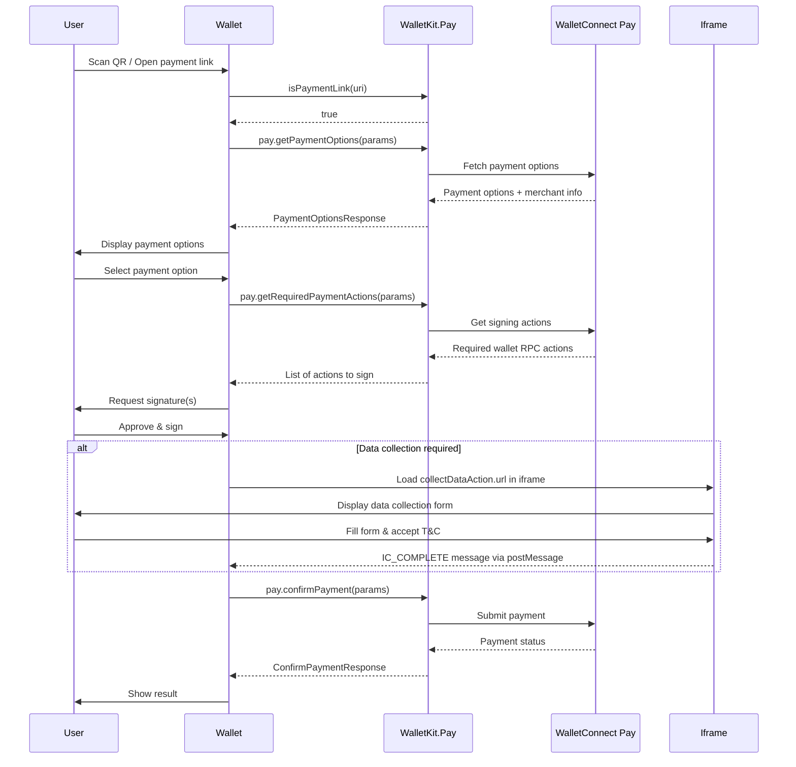

import AppIdSnippet from "/snippets/app-id.mdx";

This documentation covers integrating WalletConnect Pay through WalletKit for Web/Node.js wallets. This approach provides a unified API where Pay is built into WalletKit, simplifying the integration for wallet developers.

## Sample Wallet

For a complete working example, check out our sample wallet implementation:

<Card title="Sample Wallet - Web/Node.js (WalletKit)" icon="github" href="https://github.com/reown-com/web-examples/tree/main/advanced/wallets/react-wallet-v2">
  A reference web wallet app demonstrating WalletConnect Pay via WalletKit.
</Card>

<Tip>
**Using AI for Integration?** If you're using an AI IDE or assistant to help with integration, you can provide it with our comprehensive [AI integration prompt](/payments/wallets/walletkit/ai-prompts/react-native) for better context and guidance. The React Native prompt applies to Web/Node.js as well since they share the same JavaScript SDK.
</Tip>

## Requirements

- Node.js 16+
- WalletKit (`@reown/walletkit`)

<AppIdSnippet />

## Installation

Install WalletKit using npm or yarn:

<Tabs>
<Tab title="npm">
```bash
npm install @reown/walletkit @walletconnect/core
```
</Tab>
<Tab title="yarn">
```bash
yarn add @reown/walletkit @walletconnect/core
```
</Tab>
</Tabs>

WalletConnect Pay is automatically included as part of WalletKit.

<Info>
Check the [npm page](https://www.npmjs.com/package/@reown/walletkit) for the latest version.
</Info>

## Initialization

Initialize WalletKit as usual. Pay functionality is automatically available:

```javascript
import { Core } from "@walletconnect/core";
import { WalletKit } from "@reown/walletkit";

const core = new Core({
  projectId: process.env.PROJECT_ID,
});

const walletkit = await WalletKit.init({
  core, // <- pass the shared `core` instance
  metadata: {
    name: "Demo app",
    description: "Demo Client as Wallet/Peer",
    url: "www.walletconnect.com",
    icons: [],
  },
  payConfig: {
     appId: "<your WCP ID >",
     // or
     apiKey: "<your linked WCP Api Key>",
  }
});
```

## Payment Link Detection

Use `isPaymentLink` to determine if a scanned URI is a payment link or a standard WalletConnect pairing URI:

```javascript
import { isPaymentLink } from "@reown/walletkit";

// Use when handling a scanned QR code or deep link
if (isPaymentLink(uri)) {
  // Handle as payment (see below)
  await processPayment(uri);
} else {
  // Handle as WalletConnect pairing
  await walletkit.pair({ uri });
}
```

## Payment Flow

The payment flow consists of five main steps:

**Detect Payment Link -> Get Options -> Get Actions -> Sign Actions -> Confirm Payment**


```mermaid
sequenceDiagram
    participant User
    participant Wallet
    participant WalletKit as WalletKit.Pay
    participant Backend as WalletConnect Pay
    participant Iframe

    User->>Wallet: Scan QR / Open payment link
    Wallet->>WalletKit: isPaymentLink(uri)
    WalletKit-->>Wallet: true
    Wallet->>WalletKit: pay.getPaymentOptions(params)
    WalletKit->>Backend: Fetch payment options
    Backend-->>WalletKit: Payment options + merchant info
    WalletKit-->>Wallet: PaymentOptionsResponse
    Wallet->>User: Display payment options
    
    User->>Wallet: Select payment option
    Wallet->>WalletKit: pay.getRequiredPaymentActions(params)
    WalletKit->>Backend: Get signing actions
    Backend-->>WalletKit: Required wallet RPC actions
    WalletKit-->>Wallet: List of actions to sign
    
    Wallet->>User: Request signature(s)
    User->>Wallet: Approve & sign
    
    alt Data collection required
        Wallet->>Iframe: Load collectDataAction.url in iframe
        Iframe->>User: Display data collection form
        User->>Iframe: Fill form & accept T&C
        Iframe-->>Wallet: IC_COMPLETE message via postMessage
    end
    
    Wallet->>WalletKit: pay.confirmPayment(params)
    WalletKit->>Backend: Submit payment
    Backend-->>WalletKit: Payment status
    WalletKit-->>Wallet: ConfirmPaymentResponse
    Wallet->>User: Show result
```

<Steps>

<Step title="Get Payment Options" titleSize="h3">

Retrieve available payment options for a payment link:

```javascript
const options = await walletkit.pay.getPaymentOptions({
  paymentLink: "https://pay.walletconnect.com/...",
  accounts: ["eip155:1:0x...", "eip155:8453:0x..."],
  includePaymentInfo: true,
});

// options.paymentId - unique payment identifier
// options.options - array of payment options (different tokens/chains)
// options.info - payment details (amount, merchant, expiry)

// Display merchant info
if (options.info) {
  console.log("Merchant:", options.info.merchant.name);
  console.log("Amount:", options.info.amount.display.assetSymbol, options.info.amount.value);
}

// Check if data collection is required
if (options.collectData) {
  console.log("Required fields:", options.collectData.fields);
}
```

</Step>

<Step title="Get Required Actions" titleSize="h3">

Get the wallet RPC actions needed to complete the payment:

```javascript
const actions = await walletkit.pay.getRequiredPaymentActions({
  paymentId: options.paymentId,
  optionId: options.options[0].id,
});

// actions - array of wallet RPC calls to sign
// Each action contains: { walletRpc: { chainId, method, params } }

for (const action of actions) {
  console.log("Chain:", action.walletRpc.chainId);
  console.log("Method:", action.walletRpc.method);
  console.log("Params:", action.walletRpc.params);
}
```

</Step>

<Step title="Sign Actions" titleSize="h3">

Sign each required action using your wallet's signing implementation:

```javascript
// Sign each action based on its RPC method
const signatures = await Promise.all(
  actions.map(async (action) => {
    const { chainId, method, params } = action.walletRpc;
    const parsedParams = JSON.parse(params);

    switch (method) {
      case "eth_signTypedData_v4":
        return await wallet.signTypedData(chainId, parsedParams);
      case "eth_sendTransaction":
        return await wallet.sendTransaction(chainId, parsedParams[0]);
      case "personal_sign":
        return await wallet.personalSign(chainId, parsedParams);
      default:
        throw new Error(`Unsupported RPC method: ${method}`);
    }
  })
);
```

<Note>
Payment options may include multiple actions with different RPC methods. For example, a Permit2 payment where the user lacks sufficient allowance returns two actions: an `eth_sendTransaction` to approve the token allowance, followed by an `eth_signTypedData_v4` to sign the Permit2 transfer. Your wallet must check `action.walletRpc.method` and dispatch to the appropriate handler.
</Note>

<Warning>
Signatures must be in the same order as the actions array.
</Warning>

</Step>

<Step title="Collect User Data (If Required)" titleSize="h3">

Some payments may require additional user data:

## Iframe-Based Data Collection

When a payment requires user information (e.g., for Travel Rule compliance), the SDK returns a `collectData` field on individual payment options. Each option may independently require data collection — some options may require it while others don't.

### Recommended Flow (Per-Option)

The recommended approach is to display all payment options upfront, then handle data collection only when the user selects an option that requires it:

1. Call `getPaymentOptions` and display all available options to the user
2. Show a visual indicator (e.g., "Info required" badge) on options where `option.collectData` is present
3. When the user selects an option, check `selectedOption.collectData`
4. If present, open `selectedOption.collectData.url` in an iframe within your wallet
5. Optionally append a `prefill=<base64-json>` query parameter with known user data (e.g., name, date of birth, address). Use proper URL building to handle existing query parameters.
6. Listen for `postMessage` events: `IC_COMPLETE` (success) or `IC_ERROR` (failure)
7. On `IC_COMPLETE`, proceed to `confirmPayment()` **without** passing `collectedData` — the iframe submits data directly to the backend

### Decision Matrix

| Response `collectData` | `option.collectData` | Behavior |
|---|---|---|
| present | present | Option requires IC — use `option.collectData.url` |
| present | `null` | Option does NOT require IC (others might) — skip IC for this option |
| `null` | `null` | No IC needed for any option |

<Info>
The `collectData` also includes a `schema` field — a JSON schema string describing the required fields. The `required` list in this schema tells you which fields the form expects. Wallets can use these field names as keys when building the prefill JSON object. For example, if the schema's `required` array contains `["fullName", "dob", "pobAddress"]`, you can prefill with `{"fullName": "...", "dob": "...", "pobAddress": "..."}`.
</Info>

<Note>
The top-level `collectData` on the payment options response is still available for backward compatibility. However, the per-option `collectData` is the recommended approach as it provides more granular control over the flow.
</Note>

<Warning>
When using the iframe approach, do **not** pass `collectedData` to `confirmPayment()`. The iframe handles data submission directly.
</Warning>

```javascript
if (options.collectData?.url) {
  // Use the "required" list from options.collectData.schema to determine which fields to prefill
  const prefillData = {
    fullName: "John Doe",
    dob: "1990-01-15",
    pobAddress: "123 Main St, New York, NY 10001",
  };
  const prefillBase64 = btoa(JSON.stringify(prefillData));
  const separator = options.collectData.url.includes("?") ? "&" : "?";
  const iframeUrl = `${options.collectData.url}${separator}prefill=${prefillBase64}`;

  // Show data collection in an iframe or popup and wait for IC_COMPLETE message
  showDataCollectionView(iframeUrl);
}
```

### Iframe Message Types

The iframe communicates with your wallet through `postMessage` events. The message payload is a JSON string with the following structure:

| Message Type | Payload | Description |
|-------------|---------|-------------|
| `IC_COMPLETE` | `{ "type": "IC_COMPLETE", "success": true }` | User completed the form successfully. Proceed to payment confirmation. |
| `IC_ERROR` | `{ "type": "IC_ERROR", "error": "..." }` | An error occurred. Display the error message and allow the user to retry. |

</Step>

<Step title="Confirm Payment" titleSize="h3">

Submit the signatures and collected data to complete the payment:

```javascript
const result = await walletkit.pay.confirmPayment({
  paymentId: options.paymentId,
  optionId: options.options[0].id,
  signatures,
  collectedData, // Optional, if collectData was present
});

// result.status - "succeeded" | "processing" | "failed" | "expired"
// result.isFinal - whether the payment is complete
// result.pollInMs - if not final, poll again after this delay

if (result.status === "succeeded") {
  console.log("Payment successful!");
} else if (result.status === "processing") {
  console.log("Payment is processing...");
} else if (result.status === "failed") {
  console.log("Payment failed");
}
```

</Step>

</Steps>

## Data Collection Implementation

When `collectData.url` is present, display the URL in an iframe or modal. Listen for `postMessage` events to handle completion:

```javascript
function showDataCollectionView(url) {
  // Create a modal/overlay container
  const overlay = document.createElement("div");
  overlay.style.cssText =
    "position:fixed;top:0;left:0;width:100%;height:100%;background:rgba(0,0,0,0.5);display:flex;align-items:center;justify-content:center;z-index:9999;";

  const iframe = document.createElement("iframe");
  iframe.src = url;
  iframe.style.cssText = "width:450px;height:650px;border:none;border-radius:12px;";

  overlay.appendChild(iframe);
  document.body.appendChild(overlay);

  return new Promise((resolve, reject) => {
    function handleMessage(event) {
      try {
        const data = typeof event.data === "string" ? JSON.parse(event.data) : event.data;
        if (data.type === "IC_COMPLETE") {
          cleanup();
          resolve();
        } else if (data.type === "IC_ERROR") {
          cleanup();
          reject(new Error(data.error || "Unknown error"));
        }
      } catch {
        // Ignore non-JSON messages
      }
    }

    function cleanup() {
      window.removeEventListener("message", handleMessage);
      document.body.removeChild(overlay);
    }

    window.addEventListener("message", handleMessage);
  });
}

function buildPrefillUrl(baseUrl, prefillData) {
  if (Object.keys(prefillData).length === 0) return baseUrl;
  const base64 = btoa(JSON.stringify(prefillData));
  const separator = baseUrl.includes("?") ? "&" : "?";
  return `${baseUrl}${separator}prefill=${base64}`;
}
```

## Complete Example

Here's a complete implementation example:

```javascript
import { Core } from "@walletconnect/core";
import { WalletKit, isPaymentLink } from "@reown/walletkit";

class PaymentManager {
  constructor() {
    this.walletkit = null;
  }

  async initialize(projectId) {
    const core = new Core({ projectId });
    
    this.walletkit = await WalletKit.init({
      core,
      metadata: {
        name: "My Wallet",
        description: "A crypto wallet",
        url: "https://mywallet.com",
        icons: ["https://mywallet.com/icon.png"],
      },
    });
  }

  async handleScannedUri(uri) {
    if (isPaymentLink(uri)) {
      await this.processPayment(uri);
    } else {
      await this.walletkit.pair({ uri });
    }
  }

  async processPayment(paymentLink) {
    const walletAddress = "0xYourAddress";
    
    try {
      // Step 1: Get payment options
      const options = await this.walletkit.pay.getPaymentOptions({
        paymentLink,
        accounts: [
          `eip155:1:${walletAddress}`,
          `eip155:8453:${walletAddress}`,
          `eip155:137:${walletAddress}`,
        ],
        includePaymentInfo: true,
      });

      if (options.options.length === 0) {
        throw new Error("No payment options available");
      }

      // Step 2: Let user select an option (simplified - use first option)
      const selectedOption = options.options[0];

      // Step 3: Get required actions
      const actions = await this.walletkit.pay.getRequiredPaymentActions({
        paymentId: options.paymentId,
        optionId: selectedOption.id,
      });

      // Step 4: Sign all actions
      const signatures = await Promise.all(
        actions.map((action) => this.signAction(action, walletAddress))
      );

      // Step 5: Collect data via iframe if required
      if (options.collectData?.url) {
        await this.showDataCollectionView(options.collectData.url);
      }

      // Step 6: Confirm payment
      const result = await this.walletkit.pay.confirmPayment({
        paymentId: options.paymentId,
        optionId: selectedOption.id,
        signatures,
      });

      return result;
    } catch (error) {
      console.error("Payment failed:", error);
      throw error;
    }
  }

  async signAction(action, walletAddress) {
    const { chainId, method, params } = action.walletRpc;
    const parsedParams = JSON.parse(params);

    switch (method) {
      case "eth_signTypedData_v4":
        return await wallet.signTypedData(chainId, parsedParams);
      case "eth_sendTransaction":
        return await wallet.sendTransaction(chainId, parsedParams[0]);
      case "personal_sign":
        return await wallet.personalSign(chainId, parsedParams);
      default:
        throw new Error(`Unsupported RPC method: ${method}`);
    }
  }
}
```

## API Reference

### WalletKit Pay Methods

Pay methods are accessed via `walletkit.pay.*`.

#### Utility Functions

| Function | Description |
|----------|-------------|
| `isPaymentLink(uri: string): boolean` | Check if URI is a payment link (imported from `@reown/walletkit`) |

#### Instance Methods (walletkit.pay)

| Method | Description |
|--------|-------------|
| `getPaymentOptions(params)` | Fetch available payment options |
| `getRequiredPaymentActions(params)` | Get signing actions for a payment option |
| `confirmPayment(params)` | Confirm and execute the payment |

### Parameters

#### GetPaymentOptionsParams

```typescript
interface GetPaymentOptionsParams {
  paymentLink: string;      // Payment link URL
  accounts: string[];       // CAIP-10 accounts
  includePaymentInfo?: boolean;  // Include payment info in response
}
```

#### GetRequiredPaymentActionsParams

```typescript
interface GetRequiredPaymentActionsParams {
  paymentId: string;        // Payment ID from getPaymentOptions
  optionId: string;         // Selected option ID
}
```

#### ConfirmPaymentParams

```typescript
interface ConfirmPaymentParams {
  paymentId: string;        // Payment ID
  optionId: string;         // Selected option ID
  signatures: string[];     // Signatures from wallet RPC calls
}
```

### Response Types

#### PaymentOptionsResponse

```typescript
interface PaymentOptionsResponse {
  paymentId: string;        // Unique payment identifier
  info?: PaymentInfo;       // Payment information
  options: PaymentOption[]; // Available payment options
  collectData?: CollectDataAction;  // Data collection requirements
  resultInfo?: PaymentResultInfo;   // Transaction result details (present when payment already completed)
}

interface PaymentResultInfo {
  txId: string;             // Transaction ID
  optionAmount: PayAmount;  // Token amount details
}
```

#### PaymentOption

```typescript
interface PaymentOption {
  id: string;               // Option identifier
  amount: PayAmount;        // Amount in this asset
  etaS: number;             // Estimated time to complete (seconds)
  actions: Action[];        // Required signing actions
}
```

#### Action

```typescript
interface Action {
  walletRpc: WalletRpcAction;
}

interface WalletRpcAction {
  chainId: string;          // CAIP-2 chain ID (e.g., "eip155:8453")
  method: string;           // RPC method (e.g., "eth_signTypedData_v4", "eth_sendTransaction")
  params: string;           // JSON-encoded parameters
}
```

#### ConfirmPaymentResponse

```typescript
interface ConfirmPaymentResponse {
  status: PaymentStatus;    // Payment status
  isFinal: boolean;         // Whether status is final
  pollInMs?: number;        // Suggested poll interval
  info?: PaymentResultInfo; // Transaction result details (present on success)
}

type PaymentStatus =
  | "requires_action"
  | "processing"
  | "succeeded"
  | "failed"
  | "expired"
  | "cancelled";
```

#### PaymentInfo

```typescript
interface PaymentInfo {
  status: PaymentStatus;    // Current payment status
  amount: PayAmount;        // Requested payment amount
  expiresAt: number;        // Expiration timestamp (seconds since epoch)
  merchant: MerchantInfo;   // Merchant details
  buyer?: BuyerInfo;        // Buyer info if available
}

interface MerchantInfo {
  name: string;             // Merchant display name
  iconUrl?: string;         // Merchant logo URL
}
```

#### PayAmount

```typescript
interface PayAmount {
  unit: string;             // Asset unit
  value: string;            // Raw value in smallest unit
  display: AmountDisplay;   // Human-readable display info
}

interface AmountDisplay {
  assetSymbol: string;      // Token symbol (e.g., "USDC")
  assetName: string;        // Token name (e.g., "USD Coin")
  decimals: number;         // Token decimals
  iconUrl?: string;         // Token icon URL
  networkName?: string;     // Network name (e.g., "Base")
}
```

#### CollectDataAction

```typescript
interface CollectDataAction {
  /** URL for data collection (displayed in iframe) */
  url: string;
  /** JSON schema describing required fields */
  schema?: string;
}
```

## Error Handling

Handle errors gracefully in your payment flow:

```javascript
try {
  const options = await walletkit.pay.getPaymentOptions({
    paymentLink,
    accounts,
  });
} catch (error) {
  if (error.message.includes("payment not found")) {
    console.error("Payment not found");
  } else if (error.message.includes("expired")) {
    console.error("Payment has expired");
  } else {
    console.error("Payment error:", error);
  }
}
```

## Best Practices

1. **Use WalletKit Integration**: If your wallet already uses WalletKit, prefer this approach for automatic configuration

2. **Use `isPaymentLink()` for Detection**: Use the utility function instead of manual URL parsing for reliable payment link detection

3. **Account Format**: Always use CAIP-10 format for accounts: `eip155:{chainId}:{address}`

4. **Multiple Chains**: Provide accounts for all supported chains to maximize payment options

5. **Signature Order**: Maintain the same order of signatures as the actions array

6. **Error Handling**: Always handle errors gracefully and show appropriate user feedback

7. **Loading States**: Show loading indicators during API calls and signing operations

8. **Expiration**: Check `paymentInfo.expiresAt` and warn users if time is running low

9. **User Data**: Only collect data when `collectData` is present in the response and you don't already have the required user data. If you already have the required data, you can submit this without collecting from the user. You must make sure the user accepts WalletConnect Terms and Conditions and Privacy Policy before submitting user information to WalletConnect.

10. **Data Collection**: When `collectData.url` is present, display the URL in an iframe or modal rather than building custom forms. The hosted form handles rendering, validation, and T&C acceptance.
